# FORGE Class Model

```mermaid
---
config:
  layout: elk
---
classDiagram
    direction LR

    class Main {
        +main(String[] args)
    }

    class FacadeForgeApplication {
        -FacadeBacktestConfiguration backtestConfigurationFacade
        -InstrumentSelectionService instrumentSelectionService
        -StrategySelectionService strategySelectionService
        -RiskSettingsSelectionService riskSettingsSelectionService
        -TriggerSelectionService triggerSelectionService
        -TargetModelSelectionService targetModelSelectionService
        +void runBacktestSetup(UserInput input, UserOutput output)
        +BacktestRequest configureBacktest(UserInput input, UserOutput output)
    }

    class FacadeBacktestConfiguration {
        +BacktestRequest createBacktestRequest(String strategyName, List~String~ instruments, LocalDate startDate, LocalDate endDate, String triggerName, RiskSettings riskSettings, TargetSettings targetSettings)
        +BacktestRequest createBacktestRequest(StrategyOptions strategyOptions, List~String~ instruments, LocalDate startDate, LocalDate endDate, TradeTriggerOptions tradeTriggerOptions, RiskSettings riskSettings, TargetSettings targetSettings, OrderSettings orderSettings)
        +OrderSettings defaultOrderSettings()
    }

    class InstrumentSelectionService {
        -InstrumentDataCatalog instrumentDataCatalog
        +List~String~ selectInstruments(UserInput input, UserOutput output)
        +LocalDate[] selectDateRange(UserInput input, UserOutput output, List~String~ instruments)
    }

    class StrategySelectionService {
        -StrategyCatalog strategyCatalog
        +Class selectStrategy(UserInput input, UserOutput output)
        +String getDisplayName(Class strategy)
    }

    class RiskSettingsSelectionService {
        +RiskSettings readRiskSettings(UserInput input)
    }

    class TriggerSelectionService {
        -TriggerCatalog triggerCatalog
        +Class selectTrigger(UserInput input, UserOutput output)
        +String getDisplayName(Class trigger)
    }

    class TargetModelSelectionService {
        -TargetModelCatalog targetModelCatalog
        +Class selectTargetModel(UserInput input, UserOutput output)
        +TargetSettings readTargetModelSettings(UserInput input, Class targetModel)
        +String getDisplayName(Class targetModel)
    }

    class UserInput {
        <<interface>>
        +String readString(String label)
        +int readInt(String label)
        +double readDouble(String label)
        +LocalDate readDateOrDefault(String label, LocalDate defaultDate)
    }

    class ConsoleUserInput {
        -Scanner scanner
        +String readString(String label)
    }

    class UserOutput {
        <<interface>>
        +void printLine(String text)
        +void printBlankLine()
    }

    class ConsoleUserOutput {
        +void printLine(String text)
    }

    class Instrument {
        <<abstract>>
        -String symbolCode
        -String displayName
        #Instrument(String symbolCode, String displayName)
        +String getSymbolCode()
        +String getDisplayName()
        +String getInstrumentType()*
    }

    class FuturesContract {
        -double tickSize
        -double tickDollarAmount
        -LocalDate expirationDate
        +String getInstrumentType()
        +double getTickSize()
        +double getTickDollarAmount()
        +LocalDate getExpirationDate()
        +double calculateDollarValueForTicks(double ticks)
    }

    Instrument <|-- FuturesContract : inheritance

    class TradingStrategy {
        <<interface>>
        +String getName()
        +Optional~OrderRequest~ evaluate(MarketContext context)
    }

    class RangeBreakoutStrategy {
        -double rangeHigh
        -double rangeLow
        -int quantity
        +String getName()
        +Optional~OrderRequest~ evaluate(MarketContext context)
    }

    TradingStrategy <|.. RangeBreakoutStrategy : polymorphism

    class TradeTrigger {
        <<interface>>
        +String getName()
        +TriggerResult evaluate(MarketContext context)
    }

    class OrderFlowExhaustionTrigger {
        +String getName()
        +TriggerResult evaluate(MarketContext context)
    }

    TradeTrigger <|.. OrderFlowExhaustionTrigger : polymorphism

    class TargetModel {
        <<interface>>
        +String getName()
        +TargetResult calculateTarget(OrderSide side, double entryPrice, double stopPrice, double tickSize)
    }

    class FixedRiskRewardTarget {
        -double rewardRiskRatio
        +String getName()
        +TargetResult calculateTarget(OrderSide side, double entryPrice, double stopPrice, double tickSize)
    }

    class FixedTarget {
        -int targetTicks
        +String getName()
        +TargetResult calculateTarget(OrderSide side, double entryPrice, double stopPrice, double tickSize)
    }

    TargetModel <|.. FixedRiskRewardTarget : polymorphism
    TargetModel <|.. FixedTarget : polymorphism

    class InstrumentDataCatalog {
        +List~Instrument~ getAvailableInstruments()
        +void validateDateRange(List~String~ symbols, LocalDate startDate, LocalDate endDate)
        +double getFuturesTickSize(String symbol)
    }

    InstrumentDataCatalog --> Instrument : stores as abstract type / upcasting
    InstrumentDataCatalog ..> FuturesContract : downcasting when futures details are needed

    class StrategyCatalog {
        +List~Class~ findAvailableStrategies()
        +String getDisplayName(Class strategyClass)
    }

    class TriggerCatalog {
        +List~Class~ findAvailableTriggers()
        +String getDisplayName(Class triggerClass)
    }

    class TargetModelCatalog {
        +List~Class~ findAvailableTargetModels()
        +String getDisplayName(Class targetModelClass)
    }

    class BacktestRequest {
        -TradingStrategy strategy
        -TradeTrigger tradeTrigger
        -TargetModel targetModel
        -List~Instrument~ instruments
    }

    class OrderSettings {
        -OrderType entryOrderType
        -int quantity
        -double limitOffsetTicks
        -double stopOffsetTicks
    }

    class StrategyOptions {
        -String strategyName
    }

    class TradeTriggerOptions {
        -String triggerName
    }

    Main --> FacadeForgeApplication : uses facade
    Main --> ConsoleUserInput : adapts console input
    Main --> ConsoleUserOutput : adapts console output
    ConsoleUserInput ..|> UserInput
    ConsoleUserOutput ..|> UserOutput
    FacadeForgeApplication --> UserInput
    FacadeForgeApplication --> UserOutput
    FacadeForgeApplication --> FacadeBacktestConfiguration
    FacadeForgeApplication --> InstrumentSelectionService
    FacadeForgeApplication --> StrategySelectionService
    FacadeForgeApplication --> RiskSettingsSelectionService
    FacadeForgeApplication --> TriggerSelectionService
    FacadeForgeApplication --> TargetModelSelectionService
    FacadeForgeApplication --> BacktestRequest : creates
    InstrumentSelectionService --> InstrumentDataCatalog
    StrategySelectionService --> StrategyCatalog
    TriggerSelectionService --> TriggerCatalog
    TargetModelSelectionService --> TargetModelCatalog
    FacadeBacktestConfiguration --> BacktestRequest : creates
    FacadeBacktestConfiguration --> StrategyOptions : creates
    FacadeBacktestConfiguration --> TradeTriggerOptions : creates
    FacadeBacktestConfiguration --> OrderSettings : creates defaults

    BacktestRequest --> TradingStrategy
    BacktestRequest --> TradeTrigger
    BacktestRequest --> TargetModel
    BacktestRequest --> Instrument
```

## Assignment 1 Technique Mapping

- **Abstract class:** `Instrument` defines shared instrument behavior while requiring subclasses to provide the instrument type.
- **Inheritance:** `FuturesContract` extends `Instrument` because futures contracts are a specialized type of tradable instrument.
- **Interfaces:** `TradingStrategy`, `TradeTrigger`, and `TargetModel` define interchangeable behavior for strategies, triggers, and target calculations.
- **Polymorphism:** `BacktestRequest` and the backtesting engine can work with interface references such as `TradingStrategy`, `TradeTrigger`, and `TargetModel` without depending on specific implementations.
- **Upcasting:** `FuturesContract` objects can be stored or passed as `Instrument` references.
- **Downcasting:** `InstrumentDataCatalog` can downcast an `Instrument` to `FuturesContract` when futures-specific details such as tick size or tick dollar amount are needed.
- **Facade pattern:** `FacadeForgeApplication` gives `Main` one simple entry point for the application workflow while hiding the catalog lookups, validation order, and `BacktestRequest` assembly.
- **Configuration facade:** `FacadeBacktestConfiguration` owns construction of `BacktestRequest`, `StrategyOptions`, `TradeTriggerOptions`, and default `OrderSettings`, keeping configuration assembly inside `config/`.
- **Input abstraction:** `UserInput` separates input parsing from the facade, so the application workflow no longer depends directly on `Scanner`.
- **Output abstraction:** `UserOutput` separates console printing from the facade and selection services.
- **Service decomposition:** `InstrumentSelectionService`, `StrategySelectionService`, `RiskSettingsSelectionService`, `TriggerSelectionService`, and `TargetModelSelectionService` own the individual setup workflows so the facade can focus on coordinating the overall backtest setup.
