# FORGE Class Model

## Facade Collaboration Overview

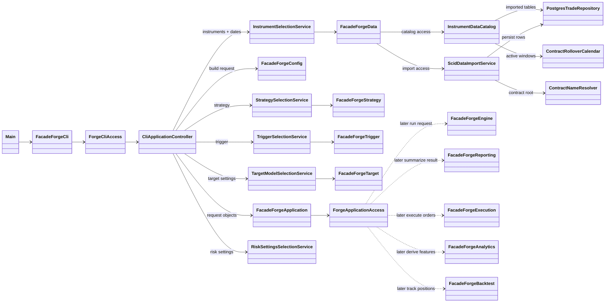

## Backtest Setup Interaction

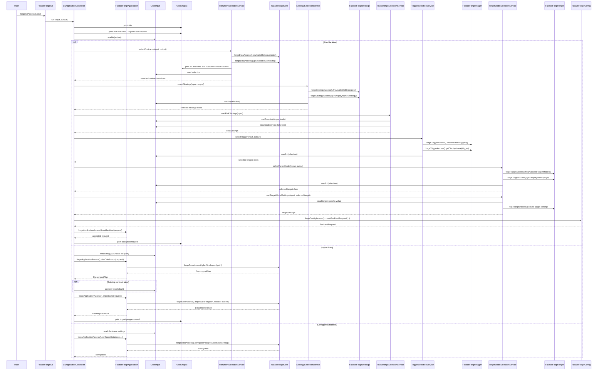

## app Package

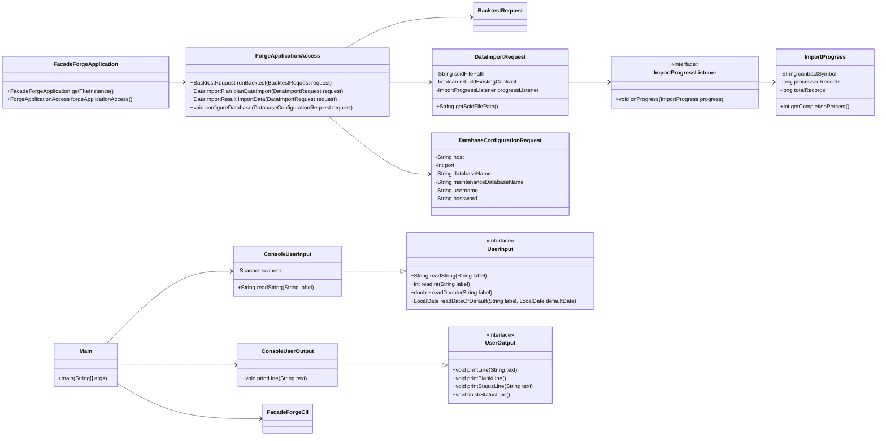

## cli Package

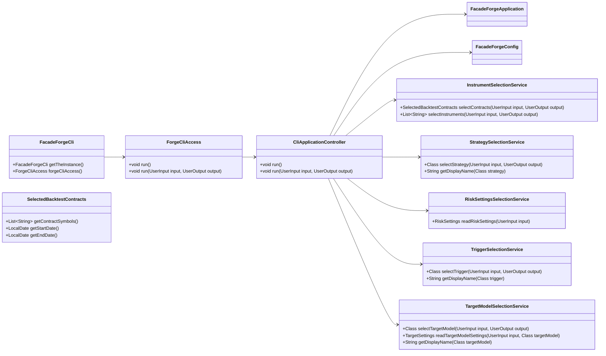

## config Package

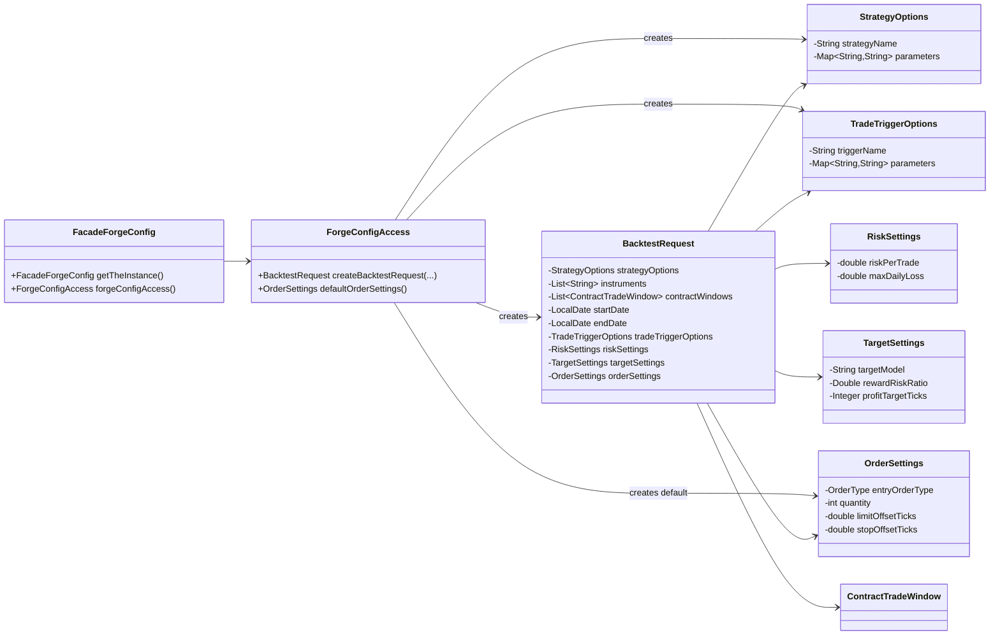

## data Package Facade

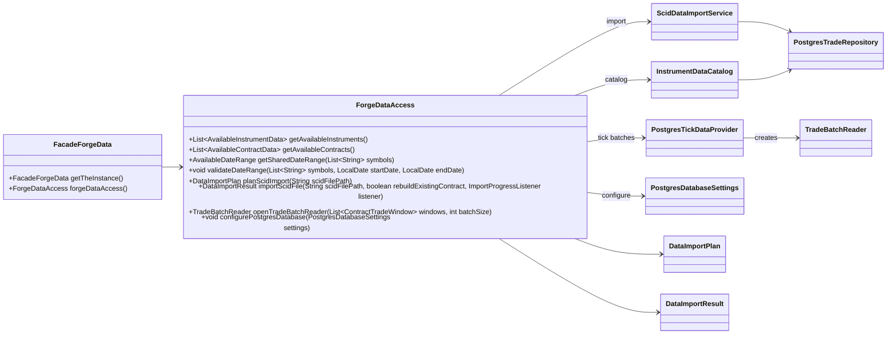

## data.catalog and model Packages

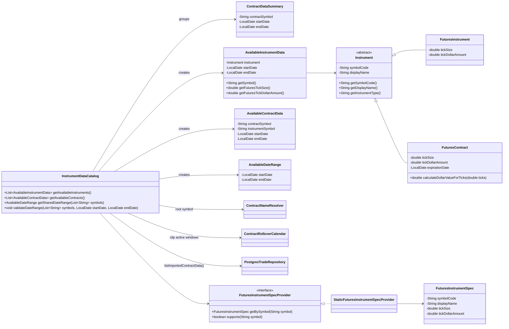

## data.contract Package

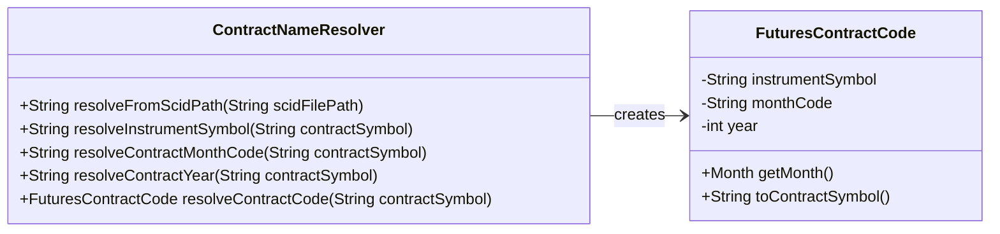

## data.rollover Package

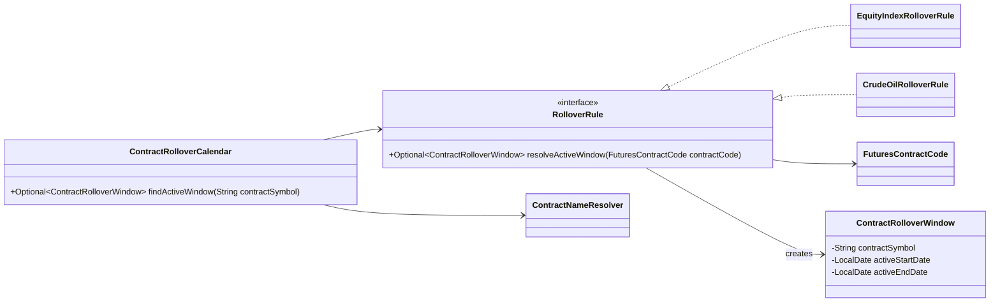

## data.importing and data.postgres Packages

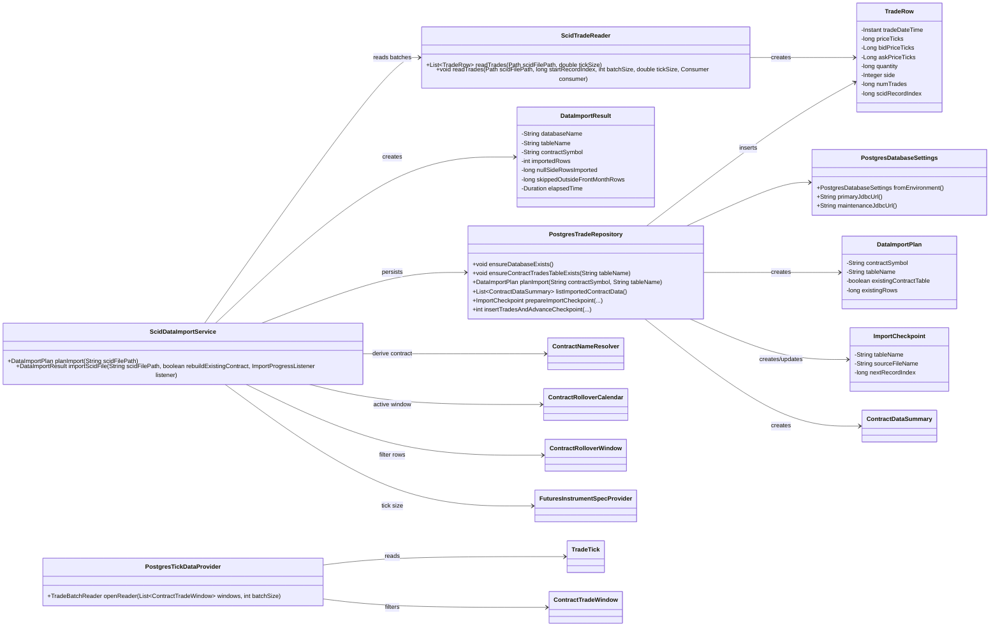

## data.market Package

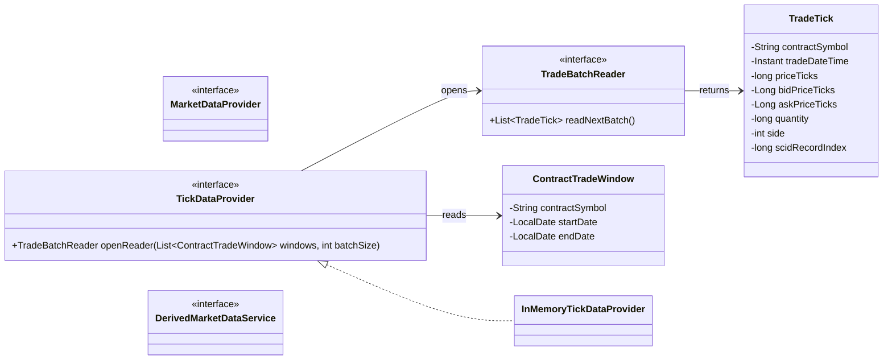

## strategy Package

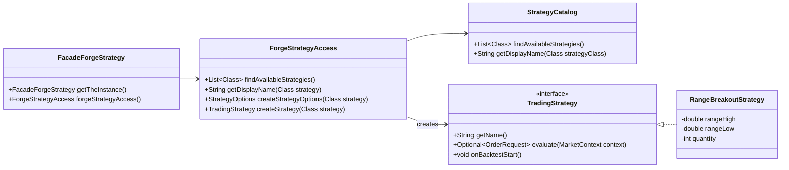

## trigger Package

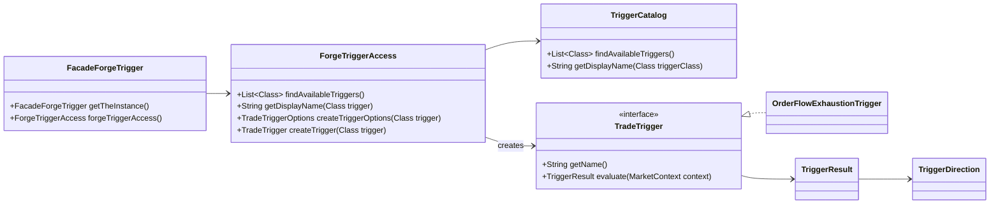

## target Package

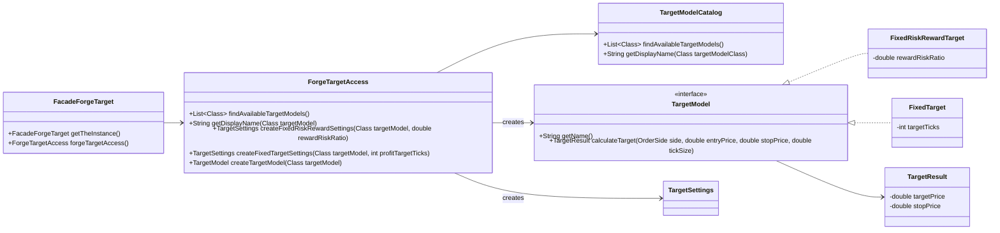

## engine Package

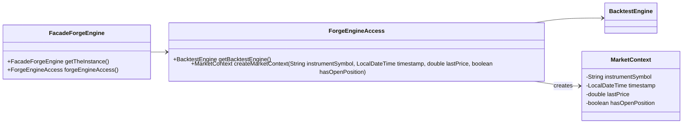

## execution Package

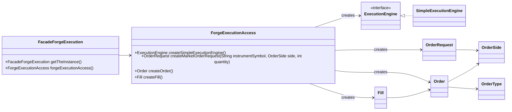

## reporting Package

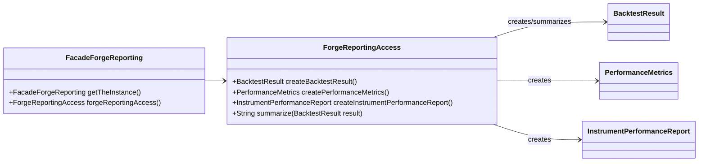

## analytics Package

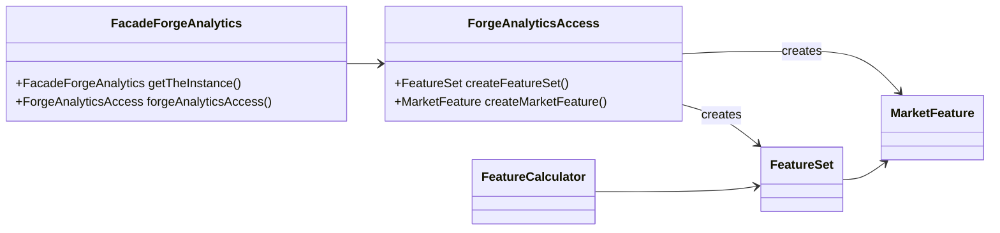

## backtest Package

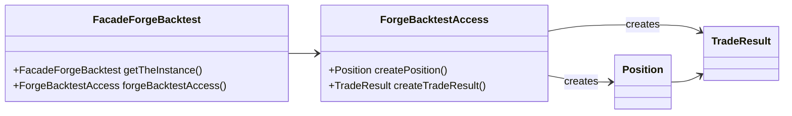

## Assignment 1 Technique Mapping

- **Abstract class:** `Instrument` defines shared instrument behavior while requiring subclasses to provide the instrument type.
- **Inheritance:** `FuturesInstrument` and `FuturesContract` extend `Instrument` because futures instruments/contracts are specialized tradable instruments.
- **Interfaces:** `TradingStrategy`, `TradeTrigger`, `TargetModel`, and `ExecutionEngine` define interchangeable behavior.
- **Polymorphism:** Backtest workflow code can work with interfaces such as `TradingStrategy`, `TradeTrigger`, and `TargetModel` without depending on specific implementations.
- **Upcasting:** `FuturesInstrument` and `FuturesContract` objects can be stored or passed as `Instrument` references.
- **Downcasting:** `InstrumentDataCatalog` can downcast an `Instrument` to `FuturesInstrument` when futures-specific details such as tick size or tick dollar amount are needed.
- **Facade pattern:** `FacadeForgeApplication` coordinates setup, while package facades such as `FacadeForgeConfig`, `FacadeForgeData`, `FacadeForgeStrategy`, `FacadeForgeTrigger`, `FacadeForgeTarget`, `FacadeForgeEngine`, `FacadeForgeExecution`, `FacadeForgeReporting`, `FacadeForgeAnalytics`, and `FacadeForgeBacktest` are singleton entry points obtained with `getTheInstance()`. Package functionality is reached through package access methods such as `forgeDataAccess()` and `forgeStrategyAccess()`.
- **Input/output abstraction:** `UserInput` and `UserOutput` keep console input/output separate from the application workflow.
- **Service decomposition:** The app selection services own individual setup steps so the app facade can focus on coordinating the overall backtest setup.
