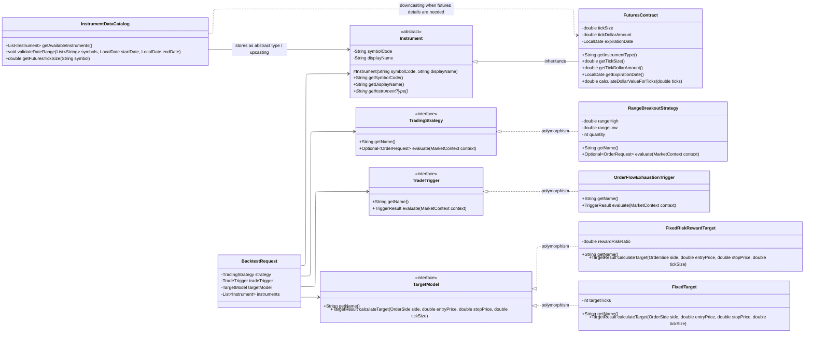

# FORGE Class Model

## Assignment 1 Technique Mapping

- **Abstract class:** `Instrument` defines shared instrument behavior while requiring subclasses to provide the instrument type.
- **Inheritance:** `FuturesContract` extends `Instrument` because futures contracts are a specialized type of tradable instrument.
- **Interfaces:** `TradingStrategy`, `TradeTrigger`, and `TargetModel` define interchangeable behavior for strategies, triggers, and target calculations.
- **Polymorphism:** `BacktestRequest` and the backtesting engine can work with interface references such as `TradingStrategy`, `TradeTrigger`, and `TargetModel` without depending on specific implementations.
- **Upcasting:** `FuturesContract` objects can be stored or passed as `Instrument` references.
- **Downcasting:** `InstrumentDataCatalog` can downcast an `Instrument` to `FuturesContract` when futures-specific details such as tick size or tick dollar amount are needed.
