# FORGE Class Model

## Facade Collaboration Overview

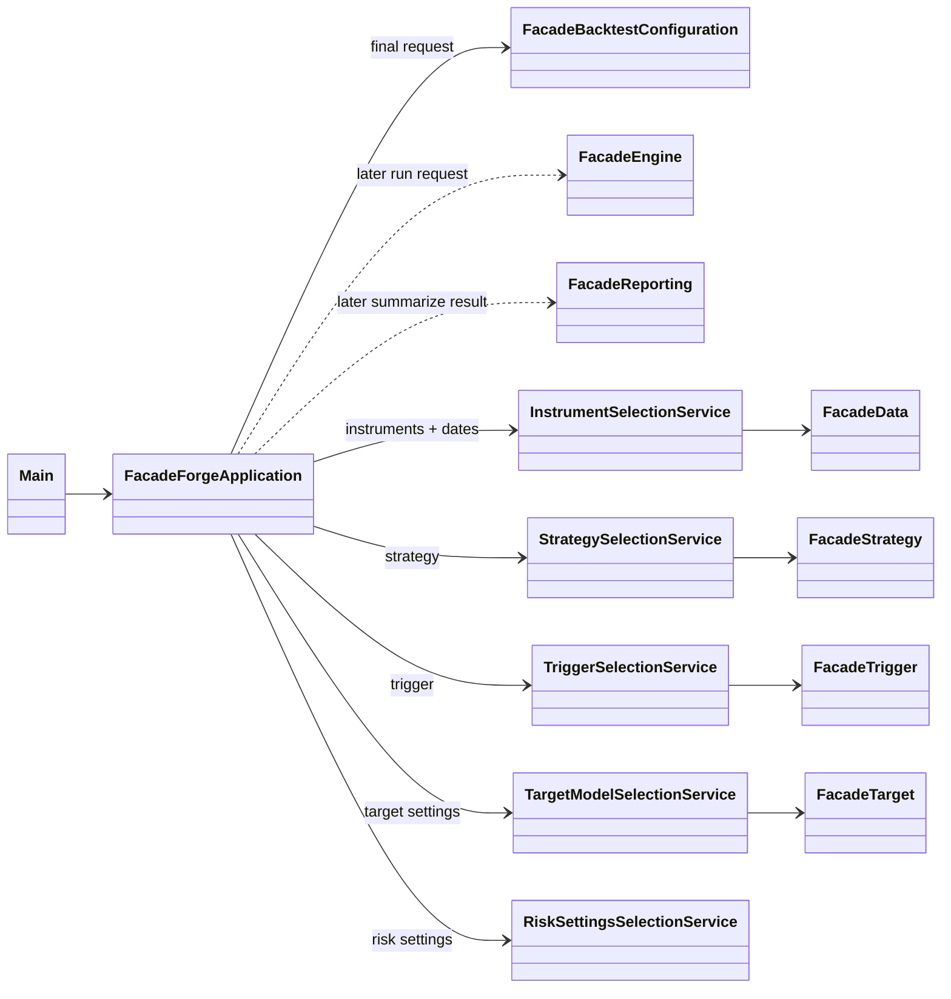

## Backtest Setup Interaction

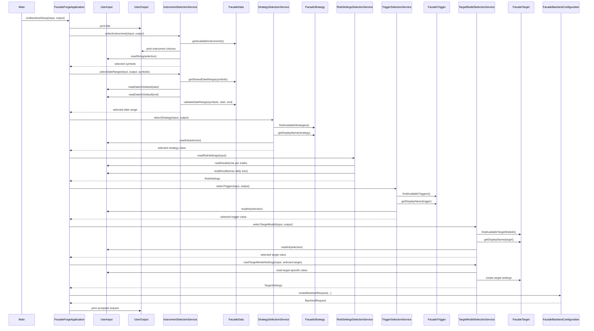

## app Package

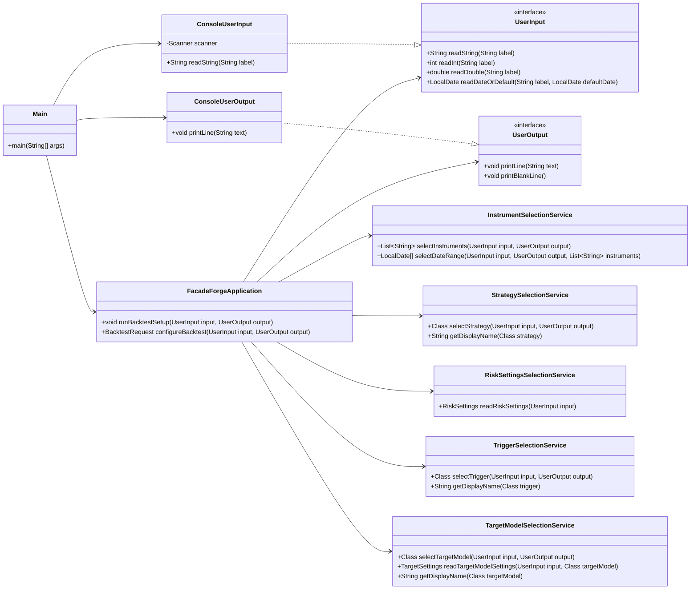

## config Package

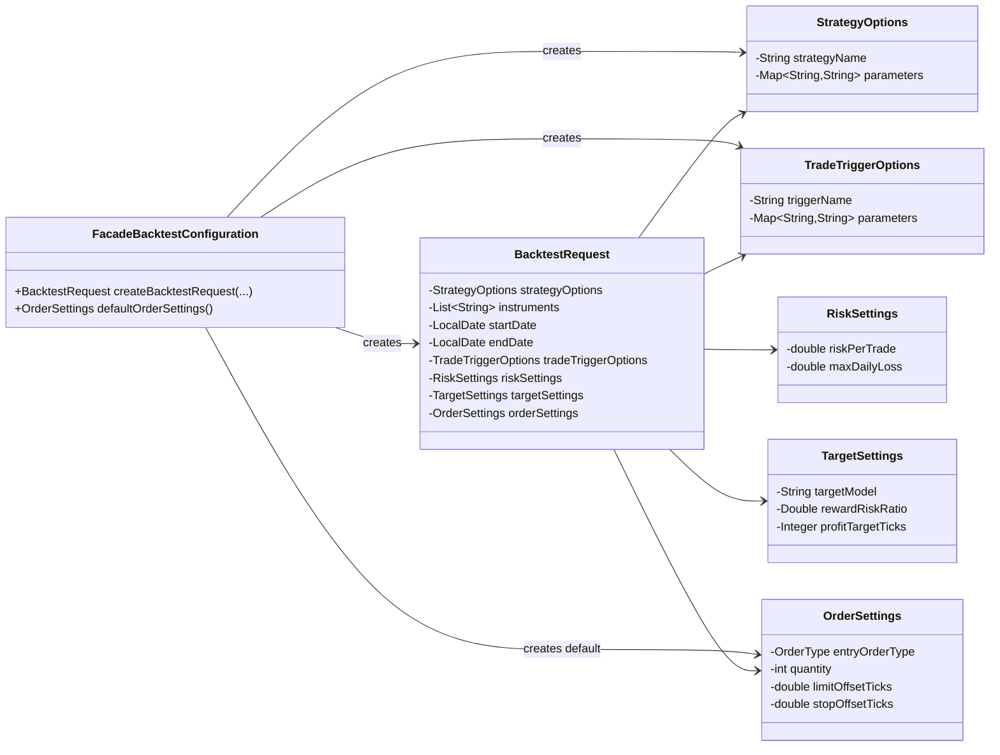

## data and model Packages

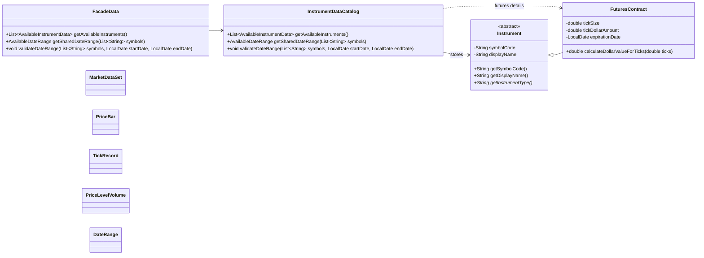

## strategy Package

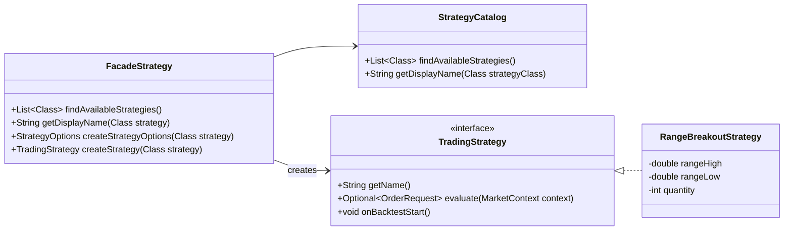

## trigger Package

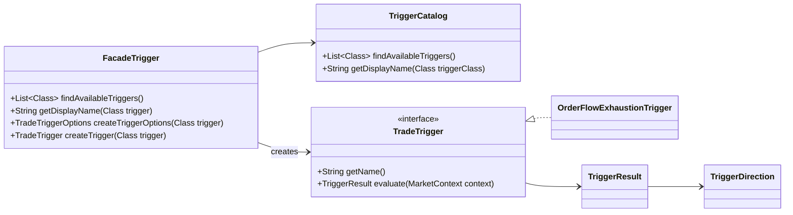

## target Package

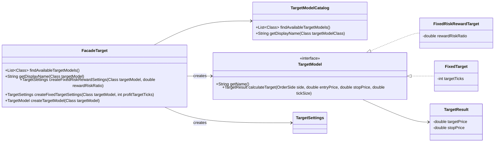

## engine Package

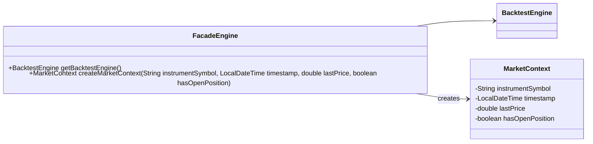

## execution Package

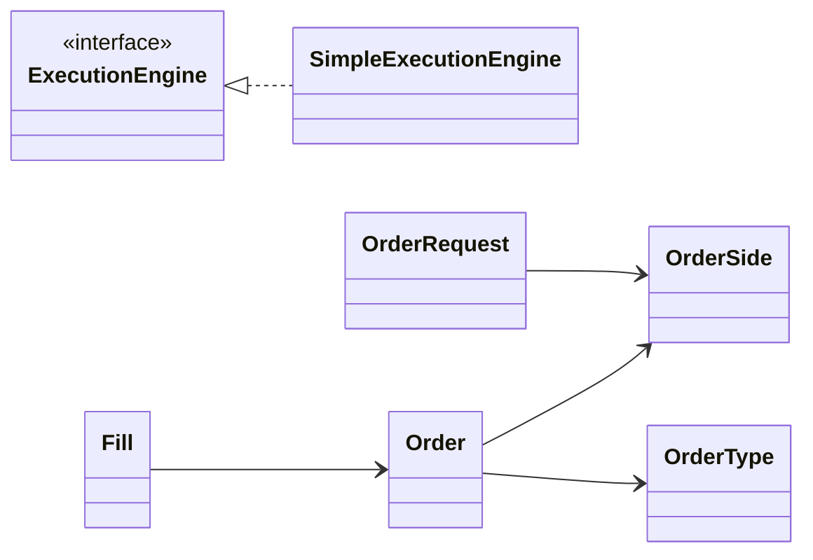

## reporting Package

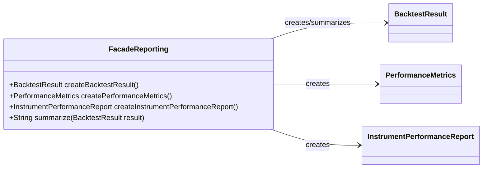

## analytics and backtest Packages

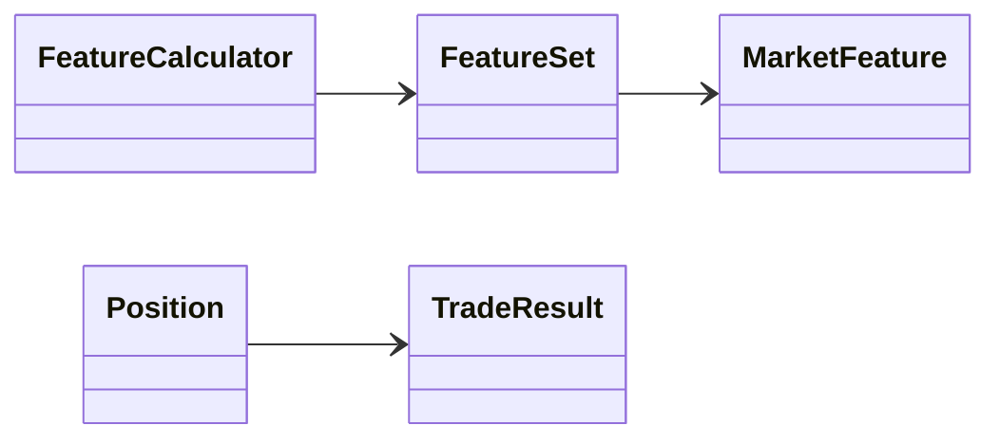

## Assignment 1 Technique Mapping

- **Abstract class:** `Instrument` defines shared instrument behavior while requiring subclasses to provide the instrument type.
- **Inheritance:** `FuturesContract` extends `Instrument` because futures contracts are a specialized type of tradable instrument.
- **Interfaces:** `TradingStrategy`, `TradeTrigger`, `TargetModel`, and `ExecutionEngine` define interchangeable behavior.
- **Polymorphism:** Backtest workflow code can work with interfaces such as `TradingStrategy`, `TradeTrigger`, and `TargetModel` without depending on specific implementations.
- **Upcasting:** `FuturesContract` objects can be stored or passed as `Instrument` references.
- **Downcasting:** `InstrumentDataCatalog` can downcast an `Instrument` to `FuturesContract` when futures-specific details such as tick size or tick dollar amount are needed.
- **Facade pattern:** `FacadeForgeApplication` coordinates setup, while package facades such as `FacadeBacktestConfiguration`, `FacadeData`, `FacadeStrategy`, `FacadeTrigger`, `FacadeTarget`, `FacadeEngine`, and `FacadeReporting` hide package internals behind simpler entry points.
- **Input/output abstraction:** `UserInput` and `UserOutput` keep console input/output separate from the application workflow.
- **Service decomposition:** The app selection services own individual setup steps so the app facade can focus on coordinating the overall backtest setup.
