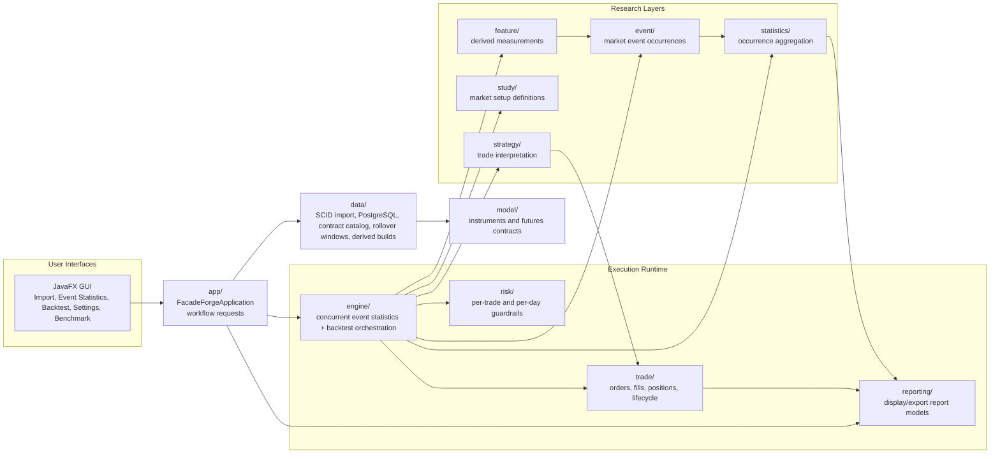

# Architecture Overview

```mermaid
flowchart LR
    subgraph UI["User Interfaces"]
        GUI["JavaFX GUI<br/>Import, Event Statistics, Backtest, Settings, Benchmark"]
    end

    APP["app/<br/>FacadeForgeApplication<br/>workflow requests"]

    subgraph Research["Research Layers"]
        FEATURE["feature/<br/>derived measurements"]
        EVENT["event/<br/>market event occurrences"]
        STUDY["study/<br/>market setup definitions"]
        STATS["statistics/<br/>occurrence aggregation"]
        STRATEGY["strategy/<br/>trade interpretation"]
    end

    subgraph Runtime["Execution Runtime"]
        ENGINE["engine/<br/>concurrent event statistics + backtest orchestration"]
        TRADE["trade/<br/>orders, fills, positions, lifecycle"]
        RISK["risk/<br/>per-trade and per-day guardrails"]
        REPORTING["reporting/<br/>display/export report models"]
    end

    DATA["data/<br/>SCID import, PostgreSQL, contract catalog, rollover windows, derived builds"]
    MODEL["model/<br/>instruments and futures contracts"]

    GUI --> APP
    APP --> DATA
    APP --> ENGINE
    APP --> REPORTING
    ENGINE --> FEATURE
    ENGINE --> EVENT
    ENGINE --> STUDY
    ENGINE --> STATS
    ENGINE --> STRATEGY
    ENGINE --> TRADE
    ENGINE --> RISK
    DATA --> MODEL
    FEATURE --> EVENT
    EVENT --> STATS
    STRATEGY --> TRADE
    TRADE --> REPORTING
    STATS --> REPORTING
```
