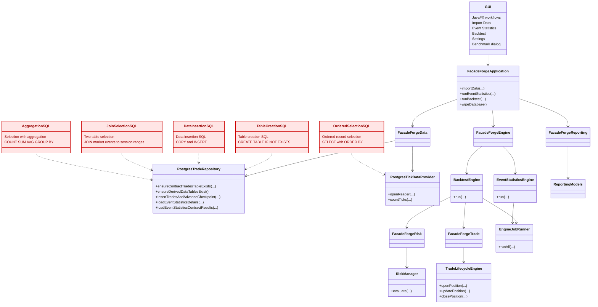

# FORGE Class Model

```mermaid

classDiagram
    direction TB

    class GUI {
        JavaFX workflows
        Import Data
        Event Statistics
        Backtest
        Settings
        Benchmark dialog
    }

    class FacadeForgeApplication {
        +importData(...)
        +runEventStatistics(...)
        +runBacktest(...)
        +wipeDatabase()
    }

    class FacadeForgeData
    class FacadeForgeEngine
    class FacadeForgeReporting
    class FacadeForgeRisk
    class FacadeForgeTrade

    class PostgresTradeRepository {
        +ensureContractTradesTableExists(...)
        +ensureDerivedDataTablesExist()
        +insertTradesAndAdvanceCheckpoint(...)
        +loadEventStatisticsDetails(...)
        +loadEventStatisticsContractResults(...)
    }

    class PostgresTickDataProvider {
        +openReader(...)
        +countTicks(...)
    }

    class BacktestEngine {
        +run(...)
    }

    class EventStatisticsEngine {
        +run(...)
    }

    class EngineJobRunner {
        +runAll(...)
    }

    class ReportingModels

    class RiskManager {
        +evaluate(...)
    }

    class TradeLifecycleEngine {
        +openPosition(...)
        +updatePosition(...)
        +closePosition(...)
    }

    class TableCreationSQL:::redNote {
        Table creation SQL
        CREATE TABLE IF NOT EXISTS
    }

    class DataInsertionSQL:::redNote {
        Data insertion SQL
        COPY and INSERT
    }

    class OrderedSelectionSQL:::redNote {
        Ordered record selection
        SELECT with ORDER BY
    }

    class JoinSelectionSQL:::redNote {
        Two table selection
        JOIN market events to session ranges
    }

    class AggregationSQL:::redNote {
        Selection with aggregation
        COUNT SUM AVG GROUP BY
    }

    GUI --> FacadeForgeApplication
    FacadeForgeApplication --> FacadeForgeData
    FacadeForgeApplication --> FacadeForgeEngine
    FacadeForgeApplication --> FacadeForgeReporting

    FacadeForgeData --> PostgresTradeRepository
    FacadeForgeData --> PostgresTickDataProvider

    FacadeForgeEngine --> BacktestEngine
    FacadeForgeEngine --> EventStatisticsEngine
    BacktestEngine --> EngineJobRunner
    EventStatisticsEngine --> EngineJobRunner
    BacktestEngine --> FacadeForgeRisk
    BacktestEngine --> FacadeForgeTrade

    FacadeForgeRisk --> RiskManager
    FacadeForgeTrade --> TradeLifecycleEngine
    FacadeForgeReporting --> ReportingModels

    TableCreationSQL ..> PostgresTradeRepository
    DataInsertionSQL ..> PostgresTradeRepository
    OrderedSelectionSQL ..> PostgresTickDataProvider
    JoinSelectionSQL ..> PostgresTradeRepository
    AggregationSQL ..> PostgresTradeRepository

    classDef redNote fill:#ffe5e5,stroke:#cc0000,color:#990000,stroke-width:2px;
```
