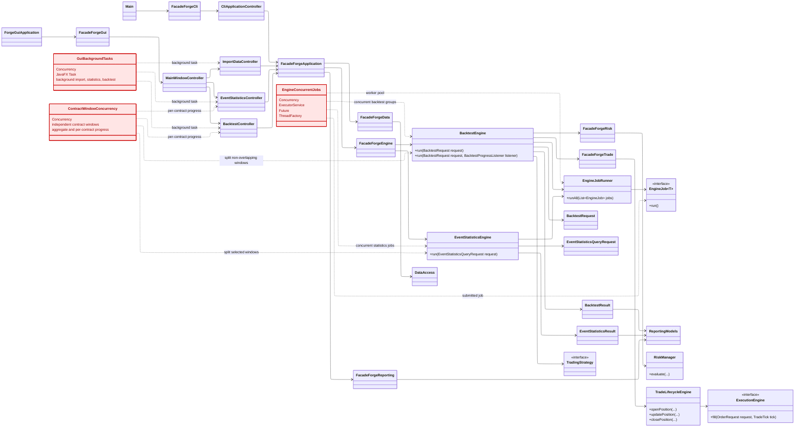

# FORGE Class Model

```mermaid
---
config:
  layout: elk
---
classDiagram
    direction LR

    class Main
    class ForgeGuiApplication
    class FacadeForgeCli
    class FacadeForgeGui
    class FacadeForgeApplication
    class FacadeForgeData
    class FacadeForgeEngine
    class FacadeForgeReporting
    class FacadeForgeRisk
    class FacadeForgeTrade

    class CliApplicationController
    class MainWindowController
    class ImportDataController
    class EventStatisticsController
    class BacktestController

    class BacktestEngine {
        +run(BacktestRequest request)
        +run(BacktestRequest request, BacktestProgressListener listener)
    }

    class EventStatisticsEngine {
        +run(EventStatisticsQueryRequest request)
    }

    class EngineJobRunner {
        +runAll(List~EngineJob~ jobs)
    }

    class EngineJob~T~ {
        <<interface>>
        +run()
    }

    class BacktestRequest
    class EventStatisticsQueryRequest
    class BacktestResult
    class EventStatisticsResult
    class ReportingModels
    class DataAccess

    class TradingStrategy {
        <<interface>>
    }

    class RiskManager {
        +evaluate(...)
    }

    class TradeLifecycleEngine {
        +openPosition(...)
        +updatePosition(...)
        +closePosition(...)
    }

    class ExecutionEngine {
        <<interface>>
        +fill(OrderRequest request, TradeTick tick)
    }

    class GuiBackgroundTasks:::redNote {
        Concurrency
        JavaFX Task
        background import, statistics, backtest
    }

    class EngineConcurrentJobs:::redNote {
        Concurrency
        ExecutorService
        Future
        ThreadFactory
    }

    class ContractWindowConcurrency:::redNote {
        Concurrency
        independent contract windows
        aggregate and per-contract progress
    }

    Main --> FacadeForgeCli
    ForgeGuiApplication --> FacadeForgeGui

    FacadeForgeCli --> CliApplicationController
    FacadeForgeGui --> MainWindowController
    MainWindowController --> ImportDataController
    MainWindowController --> EventStatisticsController
    MainWindowController --> BacktestController

    CliApplicationController --> FacadeForgeApplication
    ImportDataController --> FacadeForgeApplication
    EventStatisticsController --> FacadeForgeApplication
    BacktestController --> FacadeForgeApplication

    FacadeForgeApplication --> FacadeForgeData
    FacadeForgeApplication --> FacadeForgeEngine
    FacadeForgeApplication --> FacadeForgeReporting

    FacadeForgeEngine --> BacktestEngine
    FacadeForgeEngine --> EventStatisticsEngine

    BacktestEngine --> EngineJobRunner
    EventStatisticsEngine --> EngineJobRunner
    EngineJobRunner --> EngineJob

    BacktestEngine --> BacktestRequest
    BacktestEngine --> TradingStrategy
    BacktestEngine --> FacadeForgeRisk
    BacktestEngine --> FacadeForgeTrade
    BacktestEngine --> BacktestResult

    EventStatisticsEngine --> EventStatisticsQueryRequest
    EventStatisticsEngine --> EventStatisticsResult

    FacadeForgeData --> DataAccess
    FacadeForgeRisk --> RiskManager
    FacadeForgeTrade --> TradeLifecycleEngine
    TradeLifecycleEngine --> ExecutionEngine

    FacadeForgeReporting --> ReportingModels
    BacktestResult --> ReportingModels
    EventStatisticsResult --> ReportingModels

    GuiBackgroundTasks ..> ImportDataController : background task
    GuiBackgroundTasks ..> EventStatisticsController : background task
    GuiBackgroundTasks ..> BacktestController : background task

    EngineConcurrentJobs ..> EngineJobRunner : worker pool
    EngineConcurrentJobs ..> EngineJob : submitted job
    EngineConcurrentJobs ..> BacktestEngine : concurrent backtest groups
    EngineConcurrentJobs ..> EventStatisticsEngine : concurrent statistics jobs

    ContractWindowConcurrency ..> BacktestEngine : split non-overlapping windows
    ContractWindowConcurrency ..> EventStatisticsEngine : split selected windows
    ContractWindowConcurrency ..> BacktestController : per-contract progress
    ContractWindowConcurrency ..> EventStatisticsController : per-contract progress

    classDef redNote fill:#ffe5e5,stroke:#cc0000,color:#990000,stroke-width:2px;
```
