# FORGE Class Model

## Facade Collaboration Overview

```mermaid
classDiagram
    direction LR

    class Main
    class FacadeForgeCli
    class ForgeCliAccess
    class CliApplicationController
    class ForgeGuiApplication
    class FacadeForgeGui
    class MainWindowController
    class MainWindowView
    class ImportDataController
    class EventStatisticsController
    class BacktestController
    class FacadeForgeApplication
    class FacadeForgeConfig
    class FacadeForgeData
    class InstrumentDataCatalog
    class ContractNameResolver
    class ScidDataImportService
    class DerivedDataBuildService
    class PostgresTradeRepository
    class ContractRolloverCalendar
    class FacadeForgeStrategy
    class FacadeForgeEvent
    class FacadeForgeEngine
    class FacadeForgeFeature
    class FacadeForgeStudy
    class FacadeForgeStatistics
    class FacadeForgeTrade
    class FacadeForgeRisk
    class FacadeForgeReporting
    class ForgeApplicationAccess
    class InstrumentSelectionService

    Main --> FacadeForgeCli
    FacadeForgeCli --> ForgeCliAccess
    ForgeCliAccess --> CliApplicationController
    ForgeGuiApplication --> FacadeForgeGui
    FacadeForgeGui --> MainWindowController
    MainWindowController --> MainWindowView
    MainWindowView --> ImportDataController
    MainWindowView --> EventStatisticsController
    MainWindowView --> BacktestController
    ImportDataController --> FacadeForgeApplication
    ImportDataController --> FacadeForgeData : optional derived build
    EventStatisticsController --> FacadeForgeApplication
    BacktestController --> FacadeForgeApplication
    CliApplicationController --> FacadeForgeApplication : request objects
    FacadeForgeApplication --> ForgeApplicationAccess
    CliApplicationController --> InstrumentSelectionService : admin contract selection
    CliApplicationController --> FacadeForgeData : derived data build + wipe

    InstrumentSelectionService --> FacadeForgeData
    FacadeForgeData --> InstrumentDataCatalog : catalog access
    FacadeForgeData --> ScidDataImportService : import access
    FacadeForgeData --> DerivedDataBuildService : build access
    InstrumentDataCatalog --> PostgresTradeRepository : imported tables
    InstrumentDataCatalog --> ContractRolloverCalendar : active windows
    ScidDataImportService --> ContractNameResolver : contract root
    ScidDataImportService --> PostgresTradeRepository : persist rows
    ForgeApplicationAccess ..> FacadeForgeEngine : run backtests + statistics
    FacadeForgeEngine ..> FacadeForgeFeature : build features
    FacadeForgeEngine ..> FacadeForgeEvent : build event occurrences
    FacadeForgeEngine ..> FacadeForgeStudy : select study
    FacadeForgeEngine ..> FacadeForgeStatistics : aggregate outcomes
    ForgeApplicationAccess ..> FacadeForgeTrade : lifecycle support
    ForgeApplicationAccess ..> FacadeForgeTrade : later execute orders
    ForgeApplicationAccess ..> FacadeForgeRisk : risk checks
    ForgeApplicationAccess ..> FacadeForgeReporting : later summarize result
    FacadeForgeFeature ..> FacadeForgeEvent : features feed event occurrences
    FacadeForgeEvent ..> FacadeForgeStatistics : event occurrences feed statistics
```

## GUI Interaction Overview

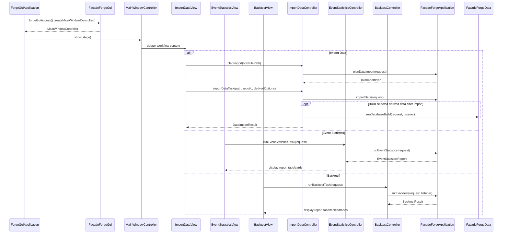

## CLI Interaction Overview

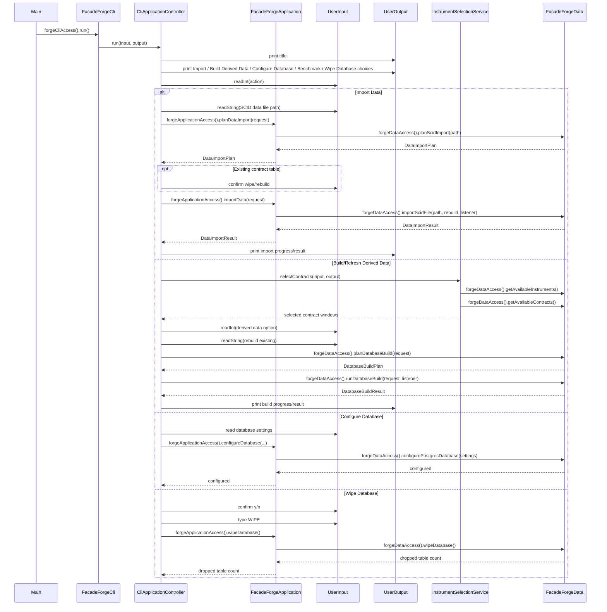

## app Package

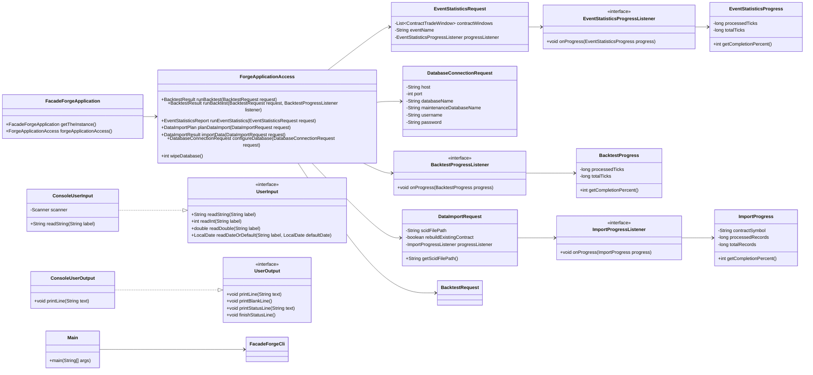

## cli Package

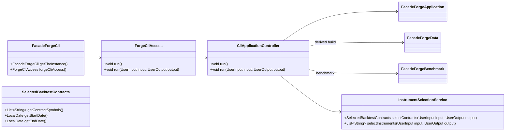

## gui Package

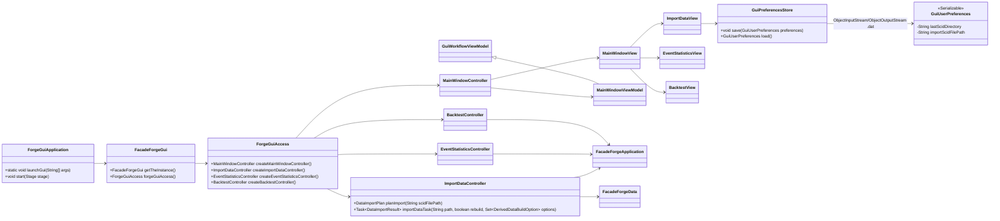

## config Package

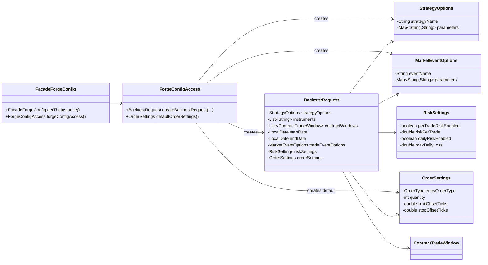

## data Package Facade

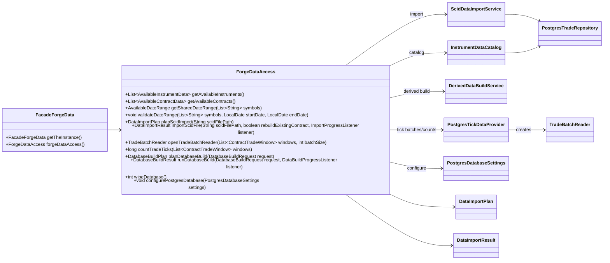

## data.build Package

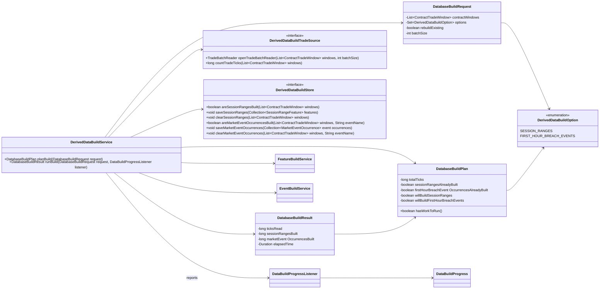

## data.catalog and model Packages

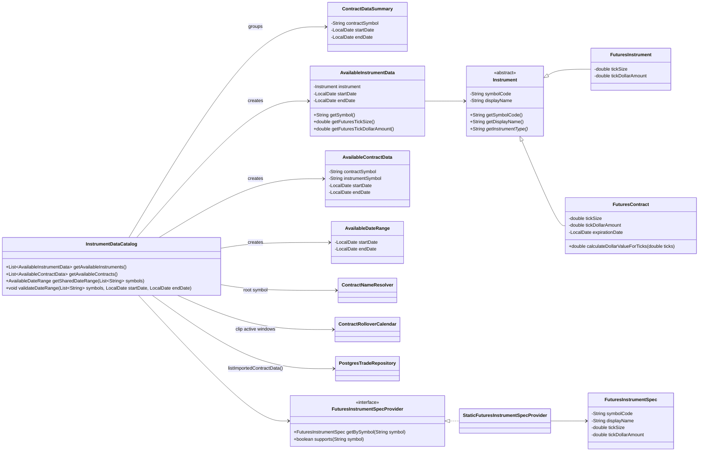

## data.contract Package

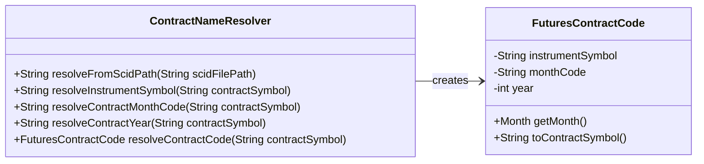

## data.rollover Package

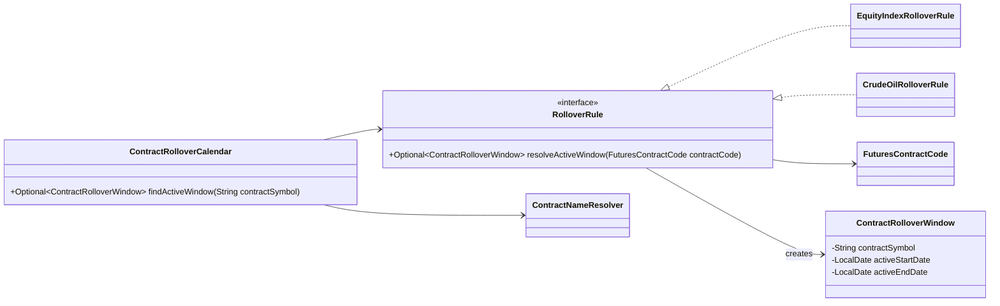

## data.importing and data.postgres Packages

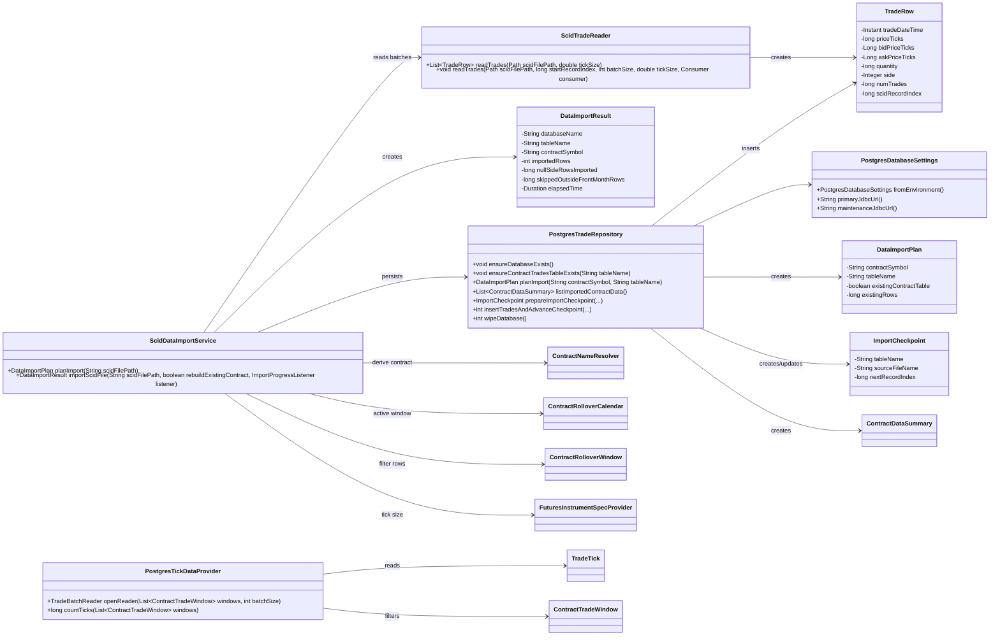

## data.market Package

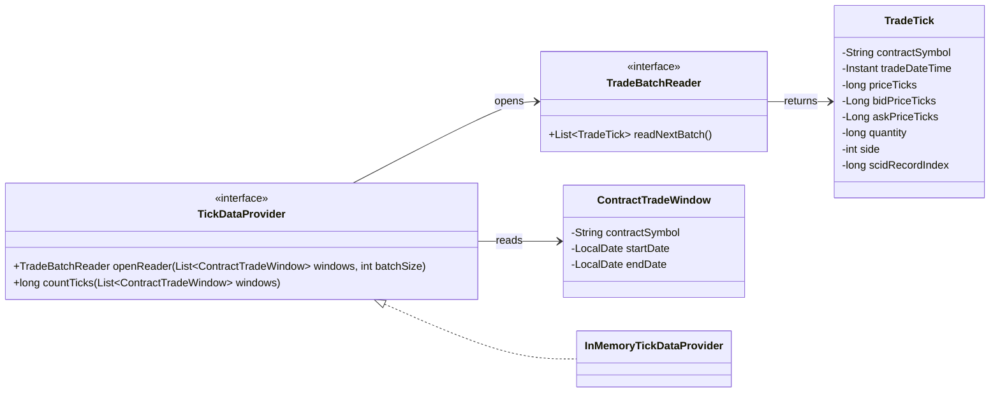

## strategy Package

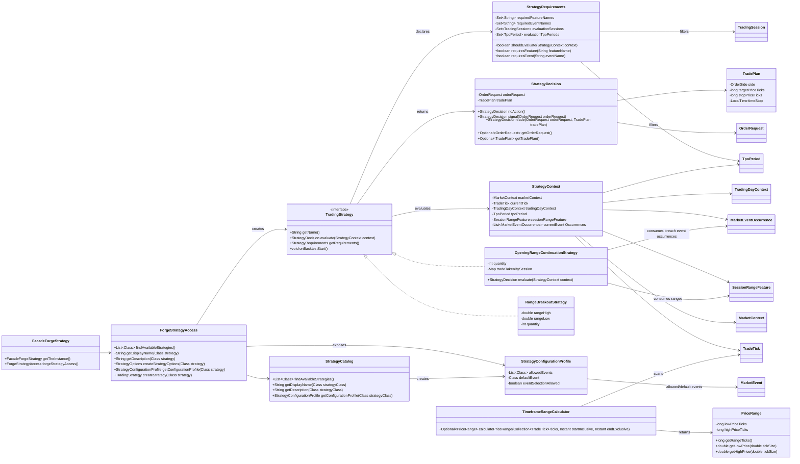

## event Package

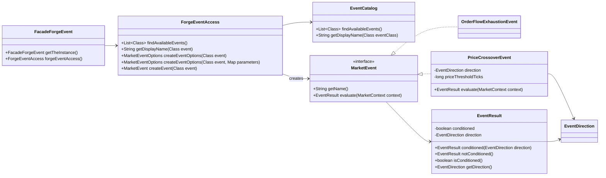

## engine, engine.backtest, and engine.eventstatistics Packages

```mermaid
classDiagram
    direction LR

    class FacadeForgeEngine {
        +FacadeForgeEngine getTheInstance()
        +ForgeEngineAccess forgeEngineAccess()
    }

    class ForgeEngineAccess {
        +BacktestEngine getBacktestEngine()
        +MarketContext createMarketContext(String instrumentSymbol, LocalDateTime timestamp, double lastPrice, boolean hasOpenPosition)
        +MarketContext createMarketContext(String instrumentSymbol, LocalDateTime timestamp, long lastPriceTicks, double tickSize, double tickDollarValue, boolean hasOpenPosition)
        +BacktestResult run(BacktestRequest request)
        +BacktestResult run(BacktestRequest request, BacktestProgressListener listener)
        +List~String~ getSupportedQueryEventNames()
        +String getEventStatisticDisplayName(String eventName)
        +String getEventStatisticDescription(String eventName)
        +EventStatisticsReport summarizeEventStatistics(EventStatisticsQuery query, Collection~SessionRangeFeature~ features, Collection~MarketEventOccurrence~ eventOccurrences)
        +EventStatisticsReport runEventStatistics(EventStatisticsQueryRequest request)
    }

    class BacktestEngine {
        +BacktestResult run(BacktestRequest request)
        +BacktestResult run(BacktestRequest request, BacktestProgressListener listener)
    }

    class RiskManager {
        +RiskDecision evaluateOpenTrade(...)
        +boolean canOpenNewTrade(...)
    }

    class BacktestResult {
        -String strategyName
        -List~String~ contractSymbols
        -long ticksProcessed
        -long orderSignalsGenerated
        -List~InstrumentBacktestResult~ instrumentResults
    }

    class InstrumentBacktestResult {
        -String instrumentSymbol
        -long ticksProcessed
        -long orderSignalsGenerated
        -List~ContractBacktestResult~ contractResults
        -PerformanceMetrics performanceMetrics
    }

    class ContractBacktestResult {
        -String contractSymbol
        -long ticksProcessed
        -long orderSignalsGenerated
        -List~TradeResult~ trades
        -PerformanceMetrics performanceMetrics
    }

    class MarketContext {
        -String instrumentSymbol
        -LocalDateTime timestamp
        -long lastPriceTicks
        -double lastPrice
        -double tickSize
        -double tickDollarValue
        -boolean hasOpenPosition
    }

    class QueryService {
        +List~String~ getSupportedQueryEventNames()
        +String getEventStatisticDisplayName(String eventName)
        +String getEventStatisticDescription(String eventName)
        +EventStatisticsReport summarizeEventStatistics(EventStatisticsQuery query, Collection~SessionRangeFeature~ features, Collection~MarketEventOccurrence~ eventOccurrences)
    }

    class EventStatisticsQueryRunner {
        +EventStatisticsReport run(EventStatisticsQueryRequest request)
    }

    class QueryTradeTickSource {
        <<interface>>
        +TradeBatchReader openTradeBatchReader(List~ContractTradeWindow~ windows, int batchSize)
        +long countTradeTicks(List~ContractTradeWindow~ windows)
    }

    class QueryDerivedDataStore {
        <<interface>>
        +boolean areSessionRangesBuilt(List~ContractTradeWindow~ windows)
        +List~SessionRangeFeature~ loadSessionRanges(List~ContractTradeWindow~ windows)
        +void saveSessionRanges(Collection~SessionRangeFeature~ features)
        +boolean areMarketEventOccurrencesBuilt(List~ContractTradeWindow~ windows, String eventName)
        +List~MarketEventOccurrence~ loadMarketEventOccurrences(List~ContractTradeWindow~ windows, String eventName)
        +void saveMarketEventOccurrences(Collection~MarketEventOccurrence~ eventOccurrences)
    }

    class EventStatisticsQuery {
        -String eventName
    }

    class EventStatisticsQueryRequest {
        -List~ContractTradeWindow~ contractWindows
        -String eventName
        -int batchSize
        -EventStatisticsProgressListener progressListener
    }

    class EventStatisticsResult {
        -String scopeName
        -String eventName
        -long sessionsAnalyzed
        -long longEventCount
        -long shortEventCount
        +long getTotalEventCount()
        +long getNoEventCount()
        +double getEventRate()
    }

    FacadeForgeEngine --> ForgeEngineAccess
    ForgeEngineAccess --> BacktestEngine
    ForgeEngineAccess --> QueryService
    ForgeEngineAccess --> EventStatisticsQueryRunner
    ForgeEngineAccess --> MarketContext : creates
    BacktestEngine --> BacktestRequest
    BacktestEngine --> BacktestProgressListener : reports progress
    BacktestEngine --> TradeBatchReader : reads batches
    BacktestEngine --> FeatureBuildService : derives features
    BacktestEngine --> EventBuildService : derives event occurrences
    BacktestEngine --> TpoPeriodClassifier : classifies periods
    BacktestEngine --> StrategyRequirements : plans evaluation
    BacktestEngine --> StrategyContext : builds
    BacktestEngine --> TradingStrategy : evaluates
    BacktestEngine --> StrategyDecision : consumes
    BacktestEngine --> ExecutionEngine : creates fills
    BacktestEngine --> FacadeForgeTrade : creates lifecycle engines
    BacktestEngine --> RiskManager : enforces risk settings
    BacktestEngine --> BacktestResult : creates
    BacktestResult --> InstrumentBacktestResult
    InstrumentBacktestResult --> ContractBacktestResult
    InstrumentBacktestResult --> PerformanceMetrics
    ContractBacktestResult --> PerformanceMetrics
    ContractBacktestResult --> TradeResult
    EventStatisticsQueryRunner --> QueryTradeTickSource
    EventStatisticsQueryRunner --> QueryDerivedDataStore
    EventStatisticsQueryRunner --> EventStatisticsQueryRequest
    EventStatisticsQueryRunner --> FeatureBuildService
    EventStatisticsQueryRunner --> EventBuildService
    EventStatisticsQueryRunner --> QueryService
    QueryService --> EventStatisticsQuery
    QueryService --> EventStatisticsReport : produces reporting model
    QueryService --> EventStatisticsResult
    EventStatisticsReport --> EventStatisticsResult
```

## trade Package

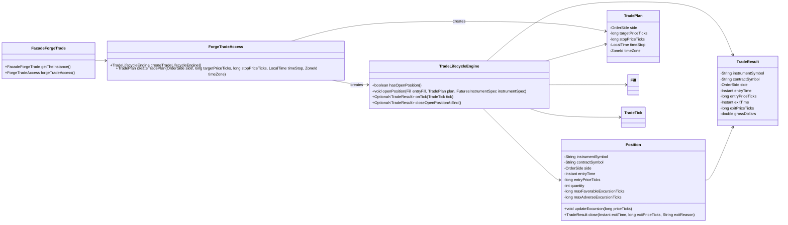

## trade Execution Models

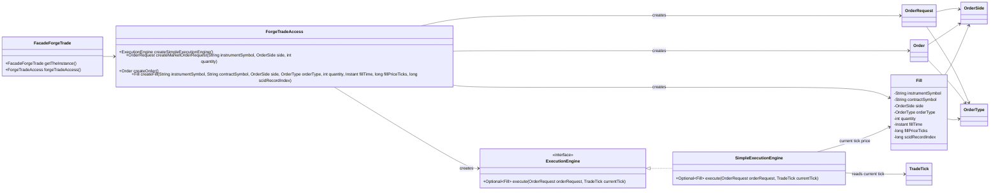

## risk Package

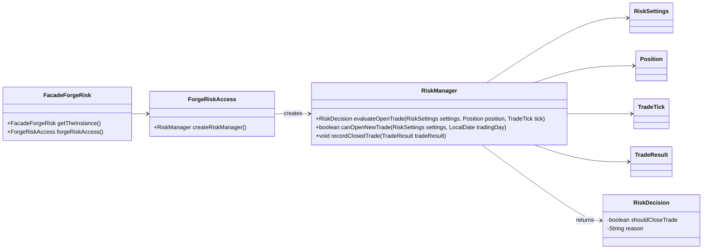

## reporting Package

```mermaid
classDiagram
    direction LR

    class FacadeForgeReporting {
        +FacadeForgeReporting getTheInstance()
        +ForgeReportingAccess forgeReportingAccess()
    }

    class ForgeReportingAccess {
        +BacktestReport buildBacktestReport(BacktestResult result)
        +String summarize(BacktestResult result)
        +String summarize(BacktestReport report)
    }

    class PerformanceMetrics {
        -int totalTrades
        -int winningTrades
        -int losingTrades
        -double netProfitLoss
        -double profitFactor
        -double maximumDrawdown
    }
    class BacktestReport {
        -String strategyName
        -List~String~ contractSymbols
        -long ticksProcessed
        -long orderSignalsGenerated
        -List~InstrumentPerformanceReport~ instrumentReports
        -List~ContractPerformanceReport~ contractReports
        -List~TradePerformanceReport~ trades
    }
    class InstrumentPerformanceReport {
        -String instrumentSymbol
        -long ticksProcessed
        -long orderSignalsGenerated
        -PerformanceMetrics performanceMetrics
        -List~ContractPerformanceReport~ contractReports
    }
    class ContractPerformanceReport {
        -String contractSymbol
        -long ticksProcessed
        -long orderSignalsGenerated
        -PerformanceMetrics performanceMetrics
        -List~TradePerformanceReport~ trades
    }
    class TradePerformanceReport {
        -String instrumentSymbol
        -String contractSymbol
        -long entryPriceTicks
        -long exitPriceTicks
        -double grossDollars
    }
    class EventStatisticsReport {
        -String eventName
        -List~EventStatisticsResult~ instrumentResults
        -List~EventStatisticsResult~ contractResults
    }

    FacadeForgeReporting --> ForgeReportingAccess
    ForgeReportingAccess --> BacktestReport : builds/summarizes
    ForgeReportingAccess --> BacktestResult : reads engine result
    BacktestReport --> InstrumentPerformanceReport
    BacktestReport --> ContractPerformanceReport
    BacktestReport --> TradePerformanceReport
    InstrumentPerformanceReport --> ContractPerformanceReport
    InstrumentPerformanceReport --> PerformanceMetrics
    ContractPerformanceReport --> TradePerformanceReport
    ContractPerformanceReport --> PerformanceMetrics
    TradePerformanceReport --> TradeResult : copies fields from
    EventStatisticsReport --> EventStatisticsResult
```

## feature Package

```mermaid
classDiagram
    direction LR

    class FacadeForgeFeature {
        +FacadeForgeFeature getTheInstance()
        +ForgeFeatureAccess forgeFeatureAccess()
    }

    class ForgeFeatureAccess {
        +List~String~ getSupportedFeatureNames()
        +List~SessionRangeFeature~ calculateSessionRanges(Collection~TradeTick~ ticks)
    }

    class FeatureDefinition {
        <<interface>>
        +String getName()
        +int getVersion()
    }

    class FeatureResult {
        -String featureName
        -int featureVersion
    }

    class FeatureCalculator {
        <<interface>>
        +FeatureDefinition getDefinition()
    }

    class FeatureBuildService {
        +List~String~ getSupportedFeatureNames()
        +List~SessionRangeFeature~ calculateSessionRanges(Collection~TradeTick~ ticks)
    }

    class TradingDayClassifier {
        +TradingDayContext classify(Instant tradeDateTime)
    }

    class TradingDayContext {
        -LocalDate tradingDay
        -TradingSession session
        +boolean isOvernight()
        +boolean isFirstHour()
        +boolean isRth()
    }

    class TpoPeriodClassifier {
        +TpoPeriod classify(Instant tradeDateTime)
    }

    class TpoPeriod {
        <<enumeration>>
        A
        B
        C
        D
        E
        F
        G
        H
        I
        J
        K
        L
        M
        N
        O
        P
        Q
        OUTSIDE_RTH
    }

    class TradingSession {
        <<enumeration>>
        OVERNIGHT
        FIRST_HOUR
        RTH
    }

    class SessionRangeFeatureCalculator {
        +List~SessionRangeFeature~ calculate(Collection~TradeTick~ ticks)
    }

    class SessionRangeFeature {
        -String contractSymbol
        -LocalDate sessionDate
        -long overnightLowTicks
        -long overnightHighTicks
        -long firstHourLowTicks
        -long firstHourHighTicks
        -long rthLowTicks
        -long rthHighTicks
    }

    FacadeForgeFeature --> ForgeFeatureAccess
    ForgeFeatureAccess --> FeatureBuildService
    FeatureCalculator --> FeatureDefinition
    FeatureBuildService --> SessionRangeFeatureCalculator
    SessionRangeFeatureCalculator --> TradingDayClassifier
    TradingDayClassifier --> TradingDayContext
    TradingDayContext --> TradingSession
    TpoPeriodClassifier --> TpoPeriod
    SessionRangeFeatureCalculator --> SessionRangeFeature
    SessionRangeFeature --|> FeatureResult
```

## event Occurrence Models

```mermaid
classDiagram
    direction LR

    class FacadeForgeEvent {
        +FacadeForgeEvent getTheInstance()
        +ForgeEventAccess forgeEventAccess()
    }

    class ForgeEventAccess {
        +List~String~ getSupportedEventNames()
        +List~MarketEventOccurrence~ detectFirstHourBreachEvents(Collection~SessionRangeFeature~ features, Collection~TradeTick~ ticks)
    }

    class EventDefinition {
        <<interface>>
        +String getName()
        +int getVersion()
    }

    class EventDetector {
        <<interface>>
        +EventDefinition getDefinition()
    }

    class EventBuildService {
        +List~String~ getSupportedEventNames()
        +List~MarketEventOccurrence~ detectFirstHourBreachEvents(Collection~SessionRangeFeature~ features, Collection~TradeTick~ ticks)
    }

    class FirstHourBreachEventDetector {
        +EventDefinition getDefinition()
        +List~MarketEventOccurrence~ detect(Collection~SessionRangeFeature~ features, Collection~TradeTick~ ticks)
    }

    class FirstHourBreachEvent {
        +String getName()
        +int getVersion()
    }

    class MarketEventOccurrence {
        -String contractSymbol
        -LocalDate sessionDate
        -String eventName
        -EventSide side
        -Instant eventTime
        -long eventPriceTicks
    }

    class EventSide

    FacadeForgeEvent --> ForgeEventAccess
    ForgeEventAccess --> EventBuildService
    EventBuildService --> FirstHourBreachEventDetector
    EventDetector --> EventDefinition
    FirstHourBreachEventDetector ..|> EventDetector
    FirstHourBreachEventDetector --> SessionRangeFeature
    FirstHourBreachEventDetector --> TradeTick
    FirstHourBreachEventDetector --> MarketEventOccurrence
    FirstHourBreachEvent ..|> EventDefinition
    MarketEventOccurrence --> EventSide
```

## study Package

```mermaid
classDiagram
    direction LR

    class FacadeForgeStudy {
        +FacadeForgeStudy getTheInstance()
        +ForgeStudyAccess forgeStudyAccess()
    }

    class ForgeStudyAccess {
        +List~String~ getSupportedStudyNames()
        +MarketStudy getStudy(String studyName)
    }

    class StudyCatalog {
        +List~MarketStudy~ findAvailableStudies()
        +List~String~ findAvailableStudyNames()
        +MarketStudy getStudy(String studyName)
    }

    class MarketStudy {
        <<interface>>
        +String getName()
        +String getDisplayName()
        +String getDescription()
    }

    class FirstHourBreachStudy

    FacadeForgeStudy --> ForgeStudyAccess
    ForgeStudyAccess --> StudyCatalog
    StudyCatalog --> MarketStudy
    FirstHourBreachStudy ..|> MarketStudy
```

## statistics Package

```mermaid
classDiagram
    direction LR

    class FacadeForgeStatistics {
        +FacadeForgeStatistics getTheInstance()
        +ForgeStatisticsAccess forgeStatisticsAccess()
    }

    class ForgeStatisticsAccess {
        +EventStatisticsReport summarizeStudyOccurrences(MarketStudy study, Collection~SessionRangeFeature~ features, Collection~MarketEventOccurrence~ eventOccurrences)
        +EventStatisticsReport summarizeEventStatistics(EventStatisticsQuery query, Collection~SessionRangeFeature~ features, Collection~MarketEventOccurrence~ eventOccurrences)
    }

    class StatisticsService {
        +EventStatisticsReport summarizeStudyOccurrences(MarketStudy study, Collection~SessionRangeFeature~ features, Collection~MarketEventOccurrence~ eventOccurrences)
        +EventStatisticsReport summarizeEventStatistics(EventStatisticsQuery query, Collection~SessionRangeFeature~ features, Collection~MarketEventOccurrence~ eventOccurrences)
    }

    FacadeForgeStatistics --> ForgeStatisticsAccess
    ForgeStatisticsAccess --> StatisticsService
    StatisticsService --> MarketStudy
    StatisticsService --> EventStatisticsReport
    StatisticsService --> EventStatisticsResult
```

## Technique Mapping

- **Abstract class:** `Instrument` defines shared instrument behavior while requiring subclasses to provide the instrument type.
- **Inheritance:** `FuturesInstrument` and `FuturesContract` extend `Instrument` because futures instruments/contracts are specialized tradable instruments.
- **Interfaces:** `TradingStrategy`, `MarketEvent`, and `ExecutionEngine` define interchangeable behavior.
- **Polymorphism:** Backtest workflow code can work with interfaces such as `TradingStrategy`, `MarketEvent`, and `ExecutionEngine` without depending on specific implementations.
- **Upcasting:** `FuturesInstrument` and `FuturesContract` objects can be stored or passed as `Instrument` references.
- **Downcasting:** `InstrumentDataCatalog` can downcast an `Instrument` to `FuturesInstrument` when futures-specific details such as tick size or tick dollar amount are needed.
- **Facade design pattern:** `FacadeForgeApplication` is the main application facade. It exposes high-level operations such as `runBacktest(...)`, `runEventStatistics(...)`, `planDataImport(...)`, `importData(...)`, `configureDatabase(...)`, and `wipeDatabase()` through `forgeApplicationAccess()`, so the GUI and CLI do not directly coordinate the engine, data import service, PostgreSQL repository, or configuration builders. Other package facades such as `FacadeForgeGui`, `FacadeForgeCli`, `FacadeForgeConfig`, `FacadeForgeData`, `FacadeForgeStrategy`, `FacadeForgeEvent`, `FacadeForgeEngine`, `FacadeForgeFeature`, `FacadeForgeStudy`, `FacadeForgeStatistics`, `FacadeForgeTrade`, `FacadeForgeRisk`, and `FacadeForgeReporting` follow the singleton `getTheInstance()` pattern and expose package behavior through package access methods such as `forgeDataAccess()` and `forgeStrategyAccess()`.
- **Integrated file I/O:** `ScidTradeReader.readTrades(...)` performs the core file I/O by opening a SCID file with `FileChannel.open(scidFilePath, StandardOpenOption.READ)`, reading binary records into a `ByteBuffer`, validating the SCID header, and converting complete records into `TradeRow` objects. `ScidDataImportService` integrates that file reader into the import workflow and also uses `Files.size(...)` and `Files.getLastModifiedTime(...)` to capture file metadata for checkpointing.
- **Exception handling:** `ConsoleUserInput` throws the user-defined `UserQuitException` when the user enters `quit` or console input ends, and `CliApplicationController` catches it to exit cleanly. Validation failures use `IllegalArgumentException` to reject invalid settings, unsupported contracts, and malformed SCID records before processing continues. File and database failures are caught as lower-level exceptions such as `IOException` or `SQLException` and wrapped in `IllegalStateException` with application-level messages.
- **Input/output abstraction:** `UserInput` and `UserOutput` keep console input/output separate from the CLI workflow, while `ConsoleUserInput` and `ConsoleUserOutput` provide the terminal implementation. JavaFX controllers use view models and background tasks instead of console I/O.
- **Service decomposition:** CLI and GUI controllers delegate domain work through package facades, while selection/build services own focused setup and maintenance steps.
