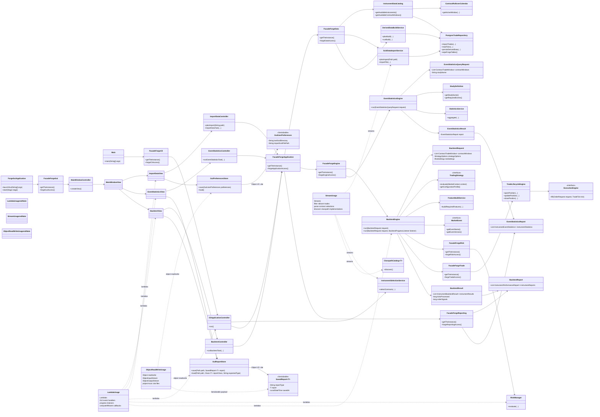

# FORGE Class Model

```mermaid
classDiagram
    direction LR

    class Main {
        +main(String[] args)
    }

    class ForgeGuiApplication {
        +launchGui(String[] args)
        +start(Stage stage)
    }

    class FacadeForgeCli {
        +getTheInstance()
        +forgeCliAccess()
    }

    class FacadeForgeGui {
        +getTheInstance()
        +forgeGuiAccess()
    }

    class FacadeForgeApplication {
        +getTheInstance()
        +forgeApplicationAccess()
    }

    class FacadeForgeData {
        +getTheInstance()
        +forgeDataAccess()
    }

    class FacadeForgeEngine {
        +getTheInstance()
        +forgeEngineAccess()
    }

    class FacadeForgeReporting {
        +getTheInstance()
        +forgeReportingAccess()
    }

    class FacadeForgeRisk {
        +getTheInstance()
        +forgeRiskAccess()
    }

    class FacadeForgeTrade {
        +getTheInstance()
        +forgeTradeAccess()
    }

    class CliApplicationController {
        +run()
    }

    class InstrumentSelectionService {
        +selectContracts(...)
    }

    class MainWindowController {
        +createView()
    }

    class ImportDataController {
        +planImport(String path)
        +importDataTask(...)
    }

    class EventStatisticsController {
        +runEventStatisticsTask(...)
    }

    class BacktestController {
        +runBacktestTask(...)
    }

    class MainWindowView
    class ImportDataView
    class EventStatisticsView
    class BacktestView

    class InstrumentDataCatalog {
        +getAvailableInstruments()
        +getAvailableContractWindows()
    }

    class ScidDataImportService {
        +planImport(Path path)
        +importFile(...)
    }

    class DerivedDataBuildService {
        +planBuild(...)
        +runBuild(...)
    }

    class PostgresTradeRepository {
        +importTrades(...)
        +readTicks(...)
        +persistDerivedData(...)
        +wipeForgeTables()
    }

    class ContractRolloverCalendar {
        +getActiveWindow(...)
    }

    class BacktestEngine {
        +run(BacktestRequest request)
        +run(BacktestRequest request, BacktestProgressListener listener)
    }

    class EventStatisticsEngine {
        +run(EventStatisticsQueryRequest request)
    }

    class BacktestRequest {
        -List~ContractTradeWindow~ contractWindows
        -StrategyOptions strategyOptions
        -RiskSettings riskSettings
    }

    class EventStatisticsQueryRequest {
        -List~ContractTradeWindow~ contractWindows
        -String studyName
    }

    class BacktestResult {
        -List~InstrumentBacktestResult~ instrumentResults
        -long ticksProcessed
        -long orderSignals
    }

    class EventStatisticsResult {
        -EventStatisticsReport report
    }

    class BacktestReport {
        -List~InstrumentPerformanceReport~ instrumentReports
    }

    class EventStatisticsReport {
        -List~InstrumentEventStatistics~ instrumentStatistics
    }

    class TradingStrategy {
        <<interface>>
        +evaluate(MarketContext context)
        +getConfigurationProfile()
    }

    class MarketEvent {
        <<interface>>
        +getEventName()
        +getEventVersion()
    }

    class FeatureBuildService {
        +buildRequiredFeatures(...)
    }

    class StudyDefinition {
        +getStudyName()
        +getRequiredEvents()
    }

    class StatisticsService {
        +aggregate(...)
    }

    class RiskManager {
        +evaluate(...)
    }

    class TradeLifecycleEngine {
        +openPosition(...)
        +updatePosition(...)
        +closePosition(...)
    }

    class ExecutionEngine {
        <<interface>>
        +fill(OrderRequest request, TradeTick tick)
    }

    class GuiPreferencesStore {
        +save(GuiUserPreferences preferences)
        +load()
    }

    class GuiUserPreferences {
        <<Serializable>>
        -String lastScidDirectory
        -String importScidFilePath
    }

    class GuiReportStore {
        +save(Path path, SavedReport~T~ report)
        +load(Path path, Class~T~ reportClass, String expectedType)
    }

    class SavedReport~T~ {
        <<Serializable>>
        -String reportType
        -T report
        -LocalDateTime savedAt
    }

    class ClasspathCatalog~T~ {
        +discover()
    }

    class LambdaUsage {
        Lambdas
        GUI event handlers
        progress listeners
        computeIfAbsent callbacks
    }

    class StreamUsage {
        Streams
        filter rollover trades
        parse contract selections
        discover classpath implementations
    }

    class ObjectReadWriteUsage {
        Object read/write
        ObjectInputStream
        ObjectOutputStream
        project-local .dat files
    }

    Main --> FacadeForgeCli
    ForgeGuiApplication --> FacadeForgeGui

    FacadeForgeCli --> CliApplicationController
    CliApplicationController --> InstrumentSelectionService
    FacadeForgeGui --> MainWindowController
    MainWindowController --> MainWindowView
    MainWindowView --> ImportDataView
    MainWindowView --> EventStatisticsView
    MainWindowView --> BacktestView

    ImportDataView --> ImportDataController
    EventStatisticsView --> EventStatisticsController
    BacktestView --> BacktestController

    CliApplicationController --> FacadeForgeApplication
    ImportDataController --> FacadeForgeApplication
    EventStatisticsController --> FacadeForgeApplication
    BacktestController --> FacadeForgeApplication

    FacadeForgeApplication --> FacadeForgeData
    FacadeForgeApplication --> FacadeForgeEngine
    FacadeForgeApplication --> FacadeForgeReporting

    FacadeForgeData --> InstrumentDataCatalog
    FacadeForgeData --> ScidDataImportService
    FacadeForgeData --> DerivedDataBuildService
    InstrumentDataCatalog --> ContractRolloverCalendar
    InstrumentDataCatalog --> PostgresTradeRepository
    ScidDataImportService --> PostgresTradeRepository
    DerivedDataBuildService --> PostgresTradeRepository

    FacadeForgeEngine --> BacktestEngine
    FacadeForgeEngine --> EventStatisticsEngine
    BacktestEngine --> BacktestRequest
    BacktestEngine --> TradingStrategy
    BacktestEngine --> FeatureBuildService
    BacktestEngine --> MarketEvent
    BacktestEngine --> FacadeForgeRisk
    BacktestEngine --> FacadeForgeTrade
    BacktestEngine --> BacktestResult
    EventStatisticsEngine --> EventStatisticsQueryRequest
    EventStatisticsEngine --> StudyDefinition
    EventStatisticsEngine --> StatisticsService
    EventStatisticsEngine --> EventStatisticsResult

    FacadeForgeRisk --> RiskManager
    FacadeForgeTrade --> TradeLifecycleEngine
    TradeLifecycleEngine --> ExecutionEngine

    FacadeForgeReporting --> BacktestReport
    FacadeForgeReporting --> EventStatisticsReport
    BacktestResult --> BacktestReport
    EventStatisticsResult --> EventStatisticsReport

    ImportDataView --> GuiPreferencesStore
    GuiPreferencesStore --> GuiUserPreferences : Object I/O .dat
    EventStatisticsView --> GuiReportStore
    BacktestView --> GuiReportStore
    GuiReportStore --> SavedReport : Object I/O .dat

    LambdaUsage ..> BacktestView : lambdas
    LambdaUsage ..> EventStatisticsView : lambdas
    LambdaUsage ..> ImportDataView : lambdas
    LambdaUsage ..> CliApplicationController : lambdas
    LambdaUsage ..> RiskManager : lambdas
    LambdaUsage ..> BacktestEngine : lambdas

    StreamUsage ..> ScidDataImportService : streams
    StreamUsage ..> InstrumentSelectionService : streams
    StreamUsage ..> ClasspathCatalog : streams

    ObjectReadWriteUsage ..> GuiPreferencesStore : object read/write
    ObjectReadWriteUsage ..> GuiReportStore : object read/write
    ObjectReadWriteUsage ..> SavedReport : Serializable payload

    classDef redNote fill:#ffe5e5,stroke:#cc0000,color:#990000,stroke-width:2px
    class LambdaUsage redNote
    class StreamUsage redNote
    class ObjectReadWriteUsage redNote
```
