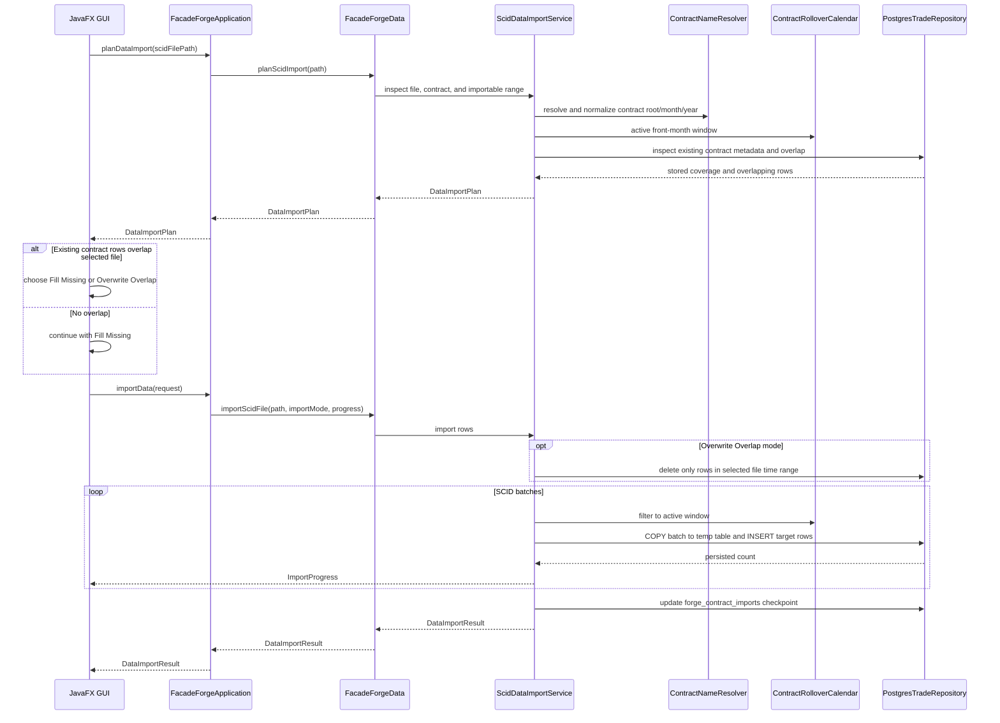

# Data Import Flow

```mermaid
sequenceDiagram
    participant UI as JavaFX GUI
    participant App as FacadeForgeApplication
    participant Data as FacadeForgeData
    participant Importer as ScidDataImportService
    participant Contract as ContractNameResolver
    participant Rollover as ContractRolloverCalendar
    participant Repo as PostgresTradeRepository

    UI->>App: planDataImport(scidFilePath)
    App->>Data: planScidImport(path)
    Data->>Importer: inspect file, contract, and importable range
    Importer->>Contract: resolve and normalize contract root/month/year
    Importer->>Rollover: active front-month window
    Importer->>Repo: inspect existing contract metadata and overlap
    Repo-->>Importer: stored coverage and overlapping rows
    Importer-->>Data: DataImportPlan
    Data-->>App: DataImportPlan
    App-->>UI: DataImportPlan

    alt Existing contract rows overlap selected file
        UI->>UI: choose Fill Missing or Overwrite Overlap
    else No overlap
        UI->>UI: continue with Fill Missing
    end

    UI->>App: importData(request)
    App->>Data: importScidFile(path, importMode, progress)
    Data->>Importer: import rows
    opt Overwrite Overlap mode
        Importer->>Repo: delete only rows in selected file time range
    end
    loop SCID batches
        Importer->>Rollover: filter to active window
        Importer->>Repo: COPY batch to temp table and INSERT target rows
        Repo-->>Importer: persisted count
        Importer-->>UI: ImportProgress
    end
    Importer->>Repo: update forge_contract_imports checkpoint
    Importer-->>Data: DataImportResult
    Data-->>App: DataImportResult
    App-->>UI: DataImportResult
```
