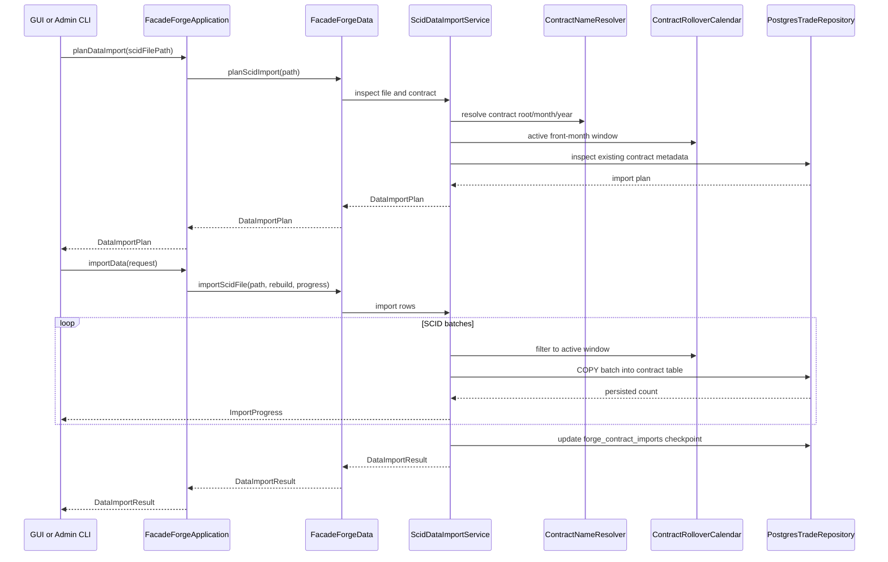

# Data Import Flow

```mermaid
sequenceDiagram
    participant UI as GUI or Admin CLI
    participant App as FacadeForgeApplication
    participant Data as FacadeForgeData
    participant Importer as ScidDataImportService
    participant Contract as ContractNameResolver
    participant Rollover as ContractRolloverCalendar
    participant Repo as PostgresTradeRepository

    UI->>App: planDataImport(scidFilePath)
    App->>Data: planScidImport(path)
    Data->>Importer: inspect file and contract
    Importer->>Contract: resolve contract root/month/year
    Importer->>Rollover: active front-month window
    Importer->>Repo: inspect existing contract metadata
    Repo-->>Importer: import plan
    Importer-->>Data: DataImportPlan
    Data-->>App: DataImportPlan
    App-->>UI: DataImportPlan

    UI->>App: importData(request)
    App->>Data: importScidFile(path, rebuild, progress)
    Data->>Importer: import rows
    loop SCID batches
        Importer->>Rollover: filter to active window
        Importer->>Repo: COPY batch into contract table
        Repo-->>Importer: persisted count
        Importer-->>UI: ImportProgress
    end
    Importer->>Repo: update forge_contract_imports checkpoint
    Importer-->>Data: DataImportResult
    Data-->>App: DataImportResult
    App-->>UI: DataImportResult
```
