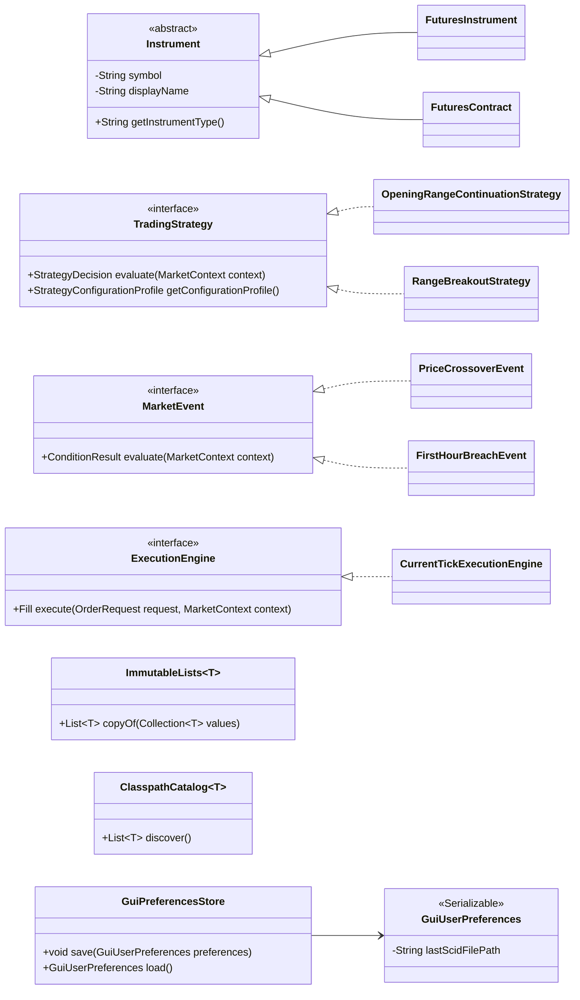

# Object-Oriented Design

```mermaid
classDiagram
    direction LR

    class Instrument {
        <<abstract>>
        -String symbol
        -String displayName
        +String getInstrumentType()
    }

    class FuturesInstrument
    class FuturesContract
    Instrument <|-- FuturesInstrument
    Instrument <|-- FuturesContract

    class TradingStrategy {
        <<interface>>
        +StrategyDecision evaluate(MarketContext context)
        +StrategyConfigurationProfile getConfigurationProfile()
    }

    class OpeningRangeContinuationStrategy
    class RangeBreakoutStrategy
    TradingStrategy <|.. OpeningRangeContinuationStrategy
    TradingStrategy <|.. RangeBreakoutStrategy

    class MarketEvent {
        <<interface>>
        +ConditionResult evaluate(MarketContext context)
    }

    class PriceCrossoverEvent
    class FirstHourBreachEvent
    MarketEvent <|.. PriceCrossoverEvent
    MarketEvent <|.. FirstHourBreachEvent

    class ExecutionEngine {
        <<interface>>
        +Fill execute(OrderRequest request, MarketContext context)
    }

    class CurrentTickExecutionEngine
    ExecutionEngine <|.. CurrentTickExecutionEngine

    class ImmutableLists~T~ {
        +List~T~ copyOf(Collection~T~ values)
    }

    class ClasspathCatalog~T~ {
        +List~T~ discover()
    }

    class GuiUserPreferences {
        <<Serializable>>
        -String lastScidFilePath
    }

    class GuiPreferencesStore {
        +void save(GuiUserPreferences preferences)
        +GuiUserPreferences load()
    }

    GuiPreferencesStore --> GuiUserPreferences
```
