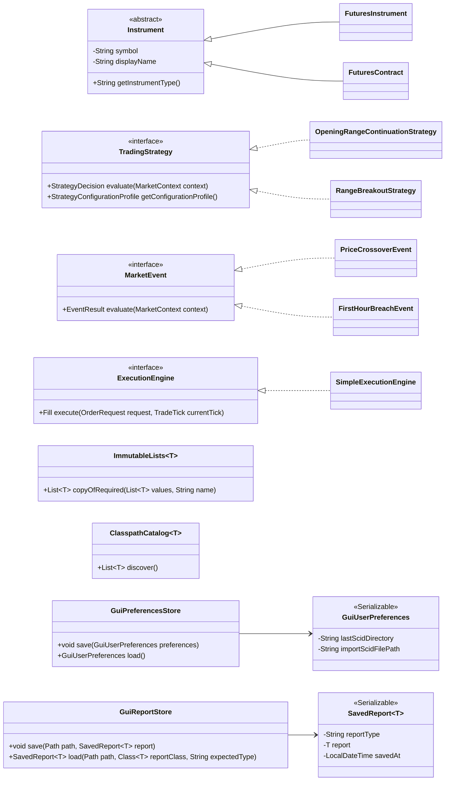

# Object-Oriented Design

```mermaid
classDiagram
    direction LR

    class Instrument {
        <<abstract>>
        -String symbol
        -String displayName
        +String getInstrumentType()
    }

    class FuturesInstrument
    class FuturesContract
    Instrument <|-- FuturesInstrument
    Instrument <|-- FuturesContract

    class TradingStrategy {
        <<interface>>
        +StrategyDecision evaluate(MarketContext context)
        +StrategyConfigurationProfile getConfigurationProfile()
    }

    class OpeningRangeContinuationStrategy
    class RangeBreakoutStrategy
    TradingStrategy <|.. OpeningRangeContinuationStrategy
    TradingStrategy <|.. RangeBreakoutStrategy

    class MarketEvent {
        <<interface>>
        +EventResult evaluate(MarketContext context)
    }

    class PriceCrossoverEvent
    class FirstHourBreachEvent
    MarketEvent <|.. PriceCrossoverEvent
    MarketEvent <|.. FirstHourBreachEvent

    class ExecutionEngine {
        <<interface>>
        +Fill execute(OrderRequest request, TradeTick currentTick)
    }

    class SimpleExecutionEngine
    ExecutionEngine <|.. SimpleExecutionEngine

    class ImmutableLists~T~ {
        +List~T~ copyOfRequired(List~T~ values, String name)
    }

    class ClasspathCatalog~T~ {
        +List~T~ discover()
    }

    class GuiUserPreferences {
        <<Serializable>>
        -String lastScidDirectory
        -String importScidFilePath
    }

    class SavedReport~T~ {
        <<Serializable>>
        -String reportType
        -T report
        -LocalDateTime savedAt
    }

    class GuiPreferencesStore {
        +void save(GuiUserPreferences preferences)
        +GuiUserPreferences load()
    }

    class GuiReportStore {
        +void save(Path path, SavedReport~T~ report)
        +SavedReport~T~ load(Path path, Class~T~ reportClass, String expectedType)
    }

    GuiPreferencesStore --> GuiUserPreferences
    GuiReportStore --> SavedReport
```
