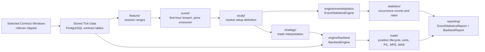

# Research and Backtest Flow

```mermaid
flowchart LR
    CONTRACTS["Selected Contract Windows<br/>rollover-clipped"]
    TICKS["Stored Tick Data<br/>PostgreSQL contract tables"]
    FEATURES["feature/<br/>session ranges"]
    EVENTS["event/<br/>first-hour breach, price crossover"]
    STUDY["study/<br/>market setup definition"]
    STATS["statistics/<br/>occurrence counts and rates"]
    STRATEGY["strategy/<br/>trade interpretation"]
    ENGINE_STATS["engine/eventstatistics<br/>EventStatisticsEngine"]
    ENGINE_BACKTEST["engine/backtest<br/>BacktestEngine"]
    TRADE["trade/<br/>position lifecycle, exits, P/L, MFE, MAE"]
    REPORTS["reporting/<br/>EventStatisticsReport + BacktestReport"]

    CONTRACTS --> TICKS
    TICKS --> FEATURES
    FEATURES --> EVENTS
    EVENTS --> STUDY
    STUDY --> ENGINE_STATS
    ENGINE_STATS --> STATS
    STATS --> REPORTS

    STUDY --> STRATEGY
    STRATEGY --> ENGINE_BACKTEST
    TICKS --> ENGINE_BACKTEST
    ENGINE_BACKTEST --> TRADE
    TRADE --> REPORTS
```
