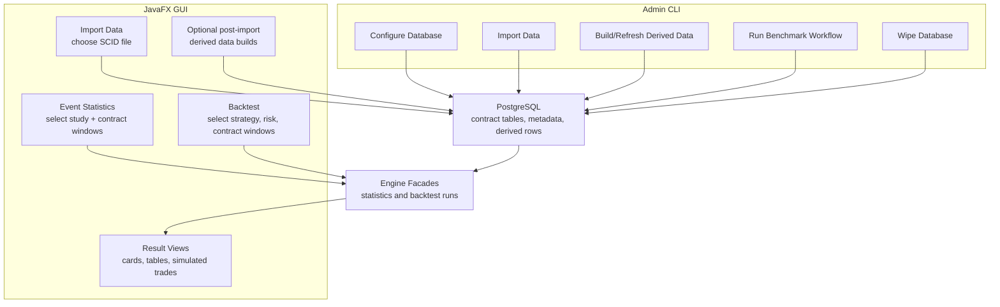

# User Workflows

```mermaid
flowchart TB
    subgraph GUI["JavaFX GUI"]
        G1["Import Data<br/>choose SCID file"]
        G2["Optional post-import<br/>derived data builds"]
        G3["Event Statistics<br/>select study + contract windows"]
        G4["Backtest<br/>select strategy, risk, contract windows"]
        G5["Result Views<br/>cards, tables, simulated trades"]
    end

    subgraph CLI["Admin CLI"]
        C1["Configure Database"]
        C2["Import Data"]
        C3["Build/Refresh Derived Data"]
        C4["Run Benchmark Workflow"]
        C5["Wipe Database"]
    end

    DATA["PostgreSQL<br/>contract tables, metadata, derived rows"]
    ENGINE["Engine Facades<br/>statistics and backtest runs"]

    C1 --> DATA
    C2 --> DATA
    C3 --> DATA
    C4 --> DATA
    C5 --> DATA

    G1 --> DATA
    G2 --> DATA
    G3 --> ENGINE
    G4 --> ENGINE
    DATA --> ENGINE
    ENGINE --> G5
```
