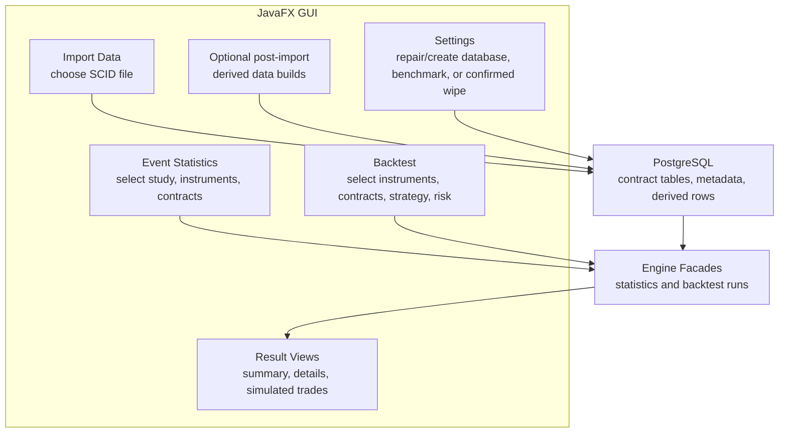
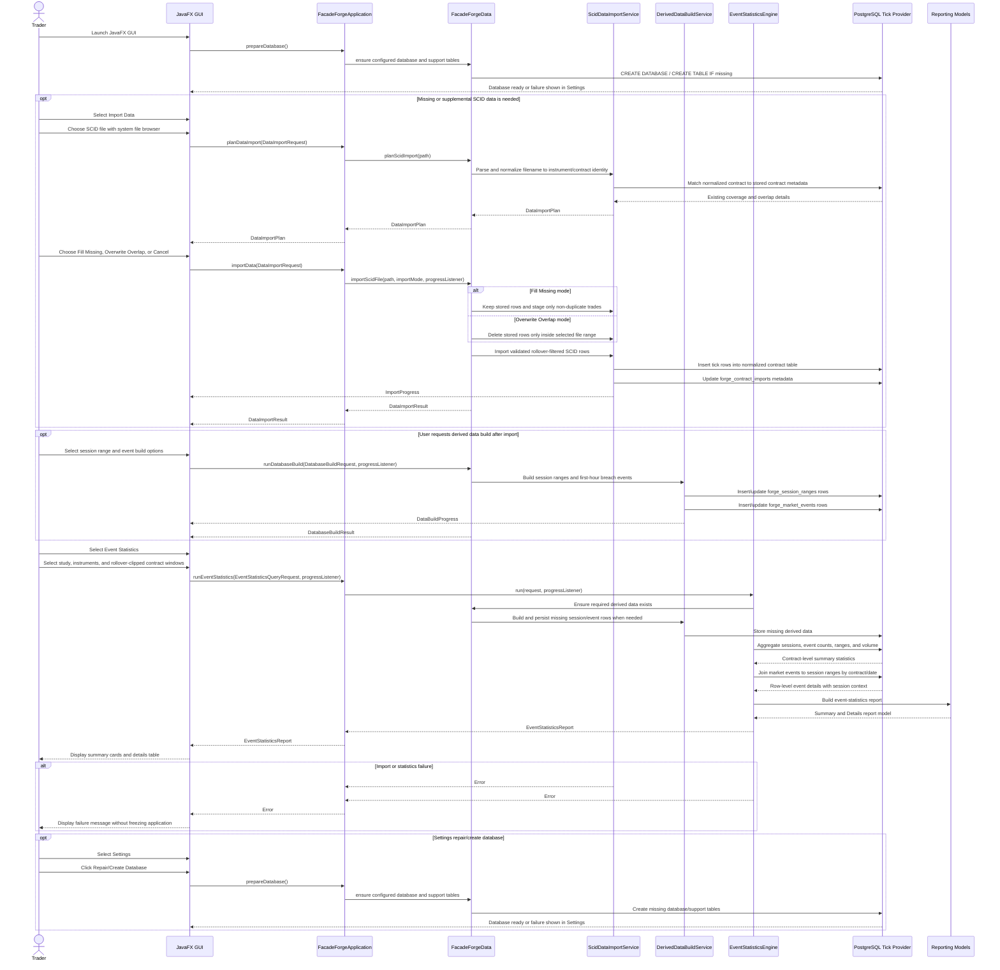
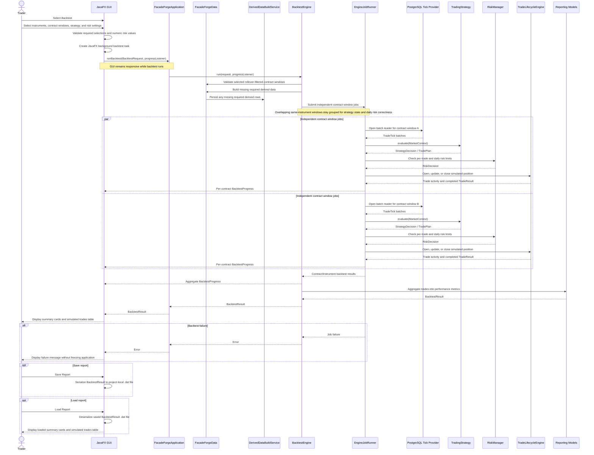
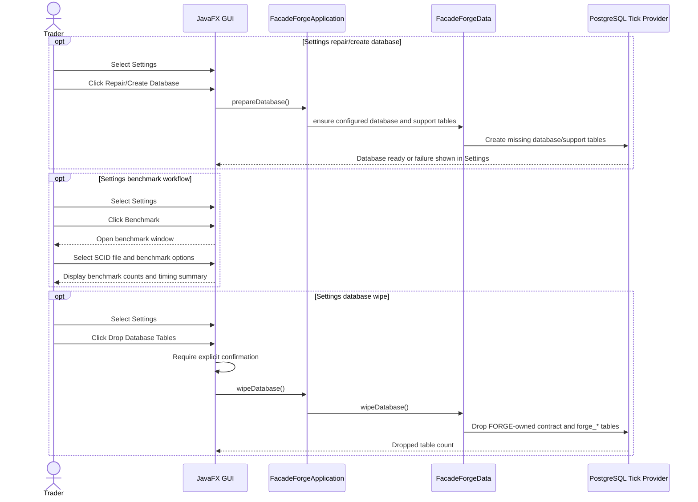

# Workflow Sequences

## User Workflow

```mermaid
flowchart TB
    subgraph GUI["JavaFX GUI"]
        G1["Import Data<br/>choose SCID file"]
        G2["Optional post-import<br/>derived data builds"]
        G3["Event Statistics<br/>select study, instruments, contracts"]
        G4["Backtest<br/>select instruments, contracts, strategy, risk"]
        G5["Result Views<br/>summary, details, simulated trades"]
        G6["Settings<br/>repair/create database, benchmark, or confirmed wipe"]
    end

    DATA["PostgreSQL<br/>contract tables, metadata, derived rows"]
    ENGINE["Engine Facades<br/>statistics and backtest runs"]

    G1 --> DATA
    G2 --> DATA
    G3 --> ENGINE
    G4 --> ENGINE
    G6 --> DATA
    DATA --> ENGINE
    ENGINE --> G5
```

## GUI Event Statistics Details Workflow

```mermaid
sequenceDiagram
    actor Trader
    participant GUI as JavaFX GUI
    participant App as FacadeForgeApplication
    participant Data as FacadeForgeData
    participant Importer as ScidDataImportService
    participant Builder as DerivedDataBuildService
    participant StatsEngine as EventStatisticsEngine
    participant Repo as PostgreSQL Tick Provider
    participant Report as Reporting Models

    Trader->>GUI: Launch JavaFX GUI
    GUI->>App: prepareDatabase()
    App->>Data: ensure configured database and support tables
    Data->>Repo: CREATE DATABASE / CREATE TABLE IF missing
    Repo-->>GUI: Database ready or failure shown in Settings

    opt Missing or supplemental SCID data is needed
        Trader->>GUI: Select Import Data
        Trader->>GUI: Choose SCID file with system file browser
        GUI->>App: planDataImport(DataImportRequest)
        App->>Data: planScidImport(path)
        Data->>Importer: Parse and normalize filename to instrument/contract identity
        Importer->>Repo: Match normalized contract to stored contract metadata
        Repo-->>Importer: Existing coverage and overlap details
        Importer-->>Data: DataImportPlan
        Data-->>App: DataImportPlan
        App-->>GUI: DataImportPlan
        Trader->>GUI: Choose Fill Missing, Overwrite Overlap, or Cancel
        GUI->>App: importData(DataImportRequest)
        App->>Data: importScidFile(path, importMode, progressListener)
        alt Fill Missing mode
            Data->>Importer: Keep stored rows and stage only non-duplicate trades
        else Overwrite Overlap mode
            Data->>Importer: Delete stored rows only inside selected file range
        end
        Data->>Importer: Import validated rollover-filtered SCID rows
        Importer->>Repo: Insert tick rows into normalized contract table
        Importer->>Repo: Update forge_contract_imports metadata
        Importer-->>GUI: ImportProgress
        Data-->>App: DataImportResult
        App-->>GUI: DataImportResult
    end

    opt User requests derived data build after import
        Trader->>GUI: Select session range and event build options
        GUI->>Data: runDatabaseBuild(DatabaseBuildRequest, progressListener)
        Data->>Builder: Build session ranges and first-hour breach events
        Builder->>Repo: Insert/update forge_session_ranges rows
        Builder->>Repo: Insert/update forge_market_events rows
        Builder-->>GUI: DataBuildProgress
        Data-->>GUI: DatabaseBuildResult
    end

    Trader->>GUI: Select Event Statistics
    Trader->>GUI: Select study, instruments, and rollover-clipped contract windows
    GUI->>App: runEventStatistics(EventStatisticsQueryRequest, progressListener)
    App->>StatsEngine: run(request, progressListener)
    StatsEngine->>Data: Ensure required derived data exists
    Data->>Builder: Build and persist missing session/event rows when needed
    Builder->>Repo: Store missing derived data
    StatsEngine->>Repo: Aggregate sessions, event counts, ranges, and volume
    Repo-->>StatsEngine: Contract-level summary statistics
    StatsEngine->>Repo: Join market events to session ranges by contract/date
    Repo-->>StatsEngine: Row-level event details with session context
    StatsEngine->>Report: Build event-statistics report
    Report-->>StatsEngine: Summary and Details report model
    StatsEngine-->>App: EventStatisticsReport
    App-->>GUI: EventStatisticsReport
    GUI-->>Trader: Display summary cards and details table

    alt Import or statistics failure
        Importer-->>App: Error
        StatsEngine-->>App: Error
        App-->>GUI: Error
        GUI-->>Trader: Display failure message without freezing application
    end

    opt Settings repair/create database
        Trader->>GUI: Select Settings
        Trader->>GUI: Click Repair/Create Database
        GUI->>App: prepareDatabase()
        App->>Data: ensure configured database and support tables
        Data->>Repo: Create missing database/support tables
        Repo-->>GUI: Database ready or failure shown in Settings
    end
```

## GUI Backtest Workflow

```mermaid
sequenceDiagram
    actor Trader
    participant GUI as JavaFX GUI
    participant App as FacadeForgeApplication
    participant Data as FacadeForgeData
    participant Builder as DerivedDataBuildService
    participant BacktestEngine as BacktestEngine
    participant Jobs as EngineJobRunner
    participant Repo as PostgreSQL Tick Provider
    participant Strategy as TradingStrategy
    participant Risk as RiskManager
    participant Trade as TradeLifecycleEngine
    participant Report as Reporting Models

    Trader->>GUI: Select Backtest
    Trader->>GUI: Select instruments, contract windows, strategy, and risk settings
    GUI->>GUI: Validate required selections and numeric risk values
    GUI->>GUI: Create JavaFX background backtest task
    GUI->>App: runBacktest(BacktestRequest, progressListener)
    Note over GUI,App: GUI remains responsive while backtest runs

    App->>BacktestEngine: run(request, progressListener)
    BacktestEngine->>Data: Validate selected rollover-filtered contract windows
    BacktestEngine->>Data: Build missing required derived data
    Data->>Builder: Persist any missing required derived rows
    BacktestEngine->>Jobs: Submit independent contract-window jobs
    Note over BacktestEngine,Jobs: Overlapping same-instrument windows stay grouped for strategy state and daily risk correctness

    par Independent contract window jobs
        Jobs->>Repo: Open batch reader for contract window A
        Repo-->>Jobs: TradeTick batches
        Jobs->>Strategy: evaluate(MarketContext)
        Strategy-->>Jobs: StrategyDecision / TradePlan
        Jobs->>Risk: Check per-trade and daily risk limits
        Risk-->>Jobs: RiskDecision
        Jobs->>Trade: Open, update, or close simulated position
        Trade-->>Jobs: Trade activity and completed TradeResult
        Jobs-->>GUI: Per-contract BacktestProgress
    and Independent contract window jobs
        Jobs->>Repo: Open batch reader for contract window B
        Repo-->>Jobs: TradeTick batches
        Jobs->>Strategy: evaluate(MarketContext)
        Strategy-->>Jobs: StrategyDecision / TradePlan
        Jobs->>Risk: Check per-trade and daily risk limits
        Risk-->>Jobs: RiskDecision
        Jobs->>Trade: Open, update, or close simulated position
        Trade-->>Jobs: Trade activity and completed TradeResult
        Jobs-->>GUI: Per-contract BacktestProgress
    end

    Jobs-->>BacktestEngine: Contract/instrument backtest results
    BacktestEngine-->>GUI: Aggregate BacktestProgress
    BacktestEngine->>Report: Aggregate trades into performance metrics
    Report-->>BacktestEngine: BacktestResult
    BacktestEngine-->>App: BacktestResult
    App-->>GUI: BacktestResult
    GUI-->>Trader: Display summary cards and simulated trades table

    alt Backtest failure
        Jobs-->>BacktestEngine: Job failure
        BacktestEngine-->>App: Error
        App-->>GUI: Error
        GUI-->>Trader: Display failure message without freezing application
    end

    opt Save report
        Trader->>GUI: Save Report
        GUI->>GUI: Serialize BacktestResult to project-local .dat file
    end

    opt Load report
        Trader->>GUI: Load Report
        GUI->>GUI: Deserialize saved BacktestResult .dat file
        GUI-->>Trader: Display loaded summary cards and simulated trades table
    end
```

## GUI Settings Workflows

```mermaid
sequenceDiagram
    actor Trader
    participant GUI as JavaFX GUI
    participant App as FacadeForgeApplication
    participant Data as FacadeForgeData
    participant Repo as PostgreSQL Tick Provider

    opt Settings repair/create database
        Trader->>GUI: Select Settings
        Trader->>GUI: Click Repair/Create Database
        GUI->>App: prepareDatabase()
        App->>Data: ensure configured database and support tables
        Data->>Repo: Create missing database/support tables
        Repo-->>GUI: Database ready or failure shown in Settings
    end

    opt Settings benchmark workflow
        Trader->>GUI: Select Settings
        Trader->>GUI: Click Benchmark
        GUI-->>Trader: Open benchmark window
        Trader->>GUI: Select SCID file and benchmark options
        GUI-->>Trader: Display benchmark counts and timing summary
    end

    opt Settings database wipe
        Trader->>GUI: Select Settings
        Trader->>GUI: Click Drop Database Tables
        GUI->>GUI: Require explicit confirmation
        GUI->>App: wipeDatabase()
        App->>Data: wipeDatabase()
        Data->>Repo: Drop FORGE-owned contract and forge_* tables
        Repo-->>GUI: Dropped table count
    end
```
