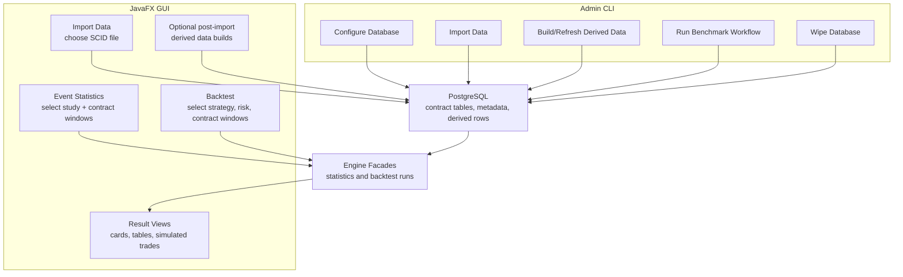
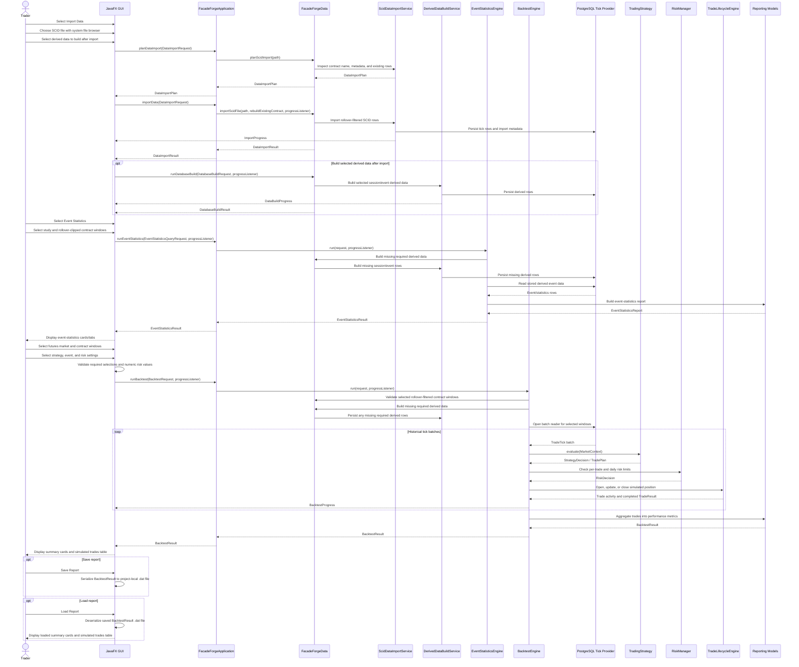
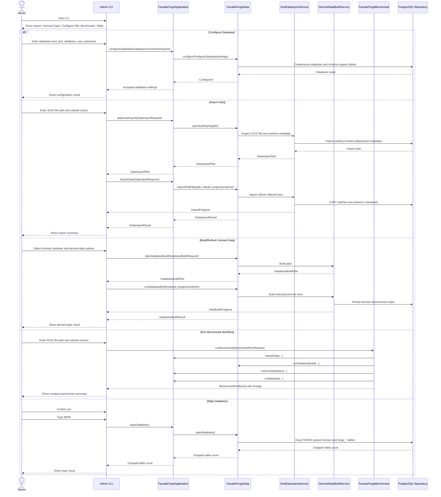

# Workflow Sequences

## User Workflows

```mermaid
flowchart TB
    subgraph GUI["JavaFX GUI"]
        G1["Import Data<br/>choose SCID file"]
        G2["Optional post-import<br/>derived data builds"]
        G3["Event Statistics<br/>select study + contract windows"]
        G4["Backtest<br/>select strategy, risk, contract windows"]
        G5["Result Views<br/>cards, tables, simulated trades"]
    end

    subgraph CLI["Admin CLI"]
        C1["Configure Database"]
        C2["Import Data"]
        C3["Build/Refresh Derived Data"]
        C4["Run Benchmark Workflow"]
        C5["Wipe Database"]
    end

    DATA["PostgreSQL<br/>contract tables, metadata, derived rows"]
    ENGINE["Engine Facades<br/>statistics and backtest runs"]

    C1 --> DATA
    C2 --> DATA
    C3 --> DATA
    C4 --> DATA
    C5 --> DATA

    G1 --> DATA
    G2 --> DATA
    G3 --> ENGINE
    G4 --> ENGINE
    DATA --> ENGINE
    ENGINE --> G5
```

## GUI End-User Workflow

```mermaid
sequenceDiagram
    actor Trader
    participant GUI as JavaFX GUI
    participant App as FacadeForgeApplication
    participant Data as FacadeForgeData
    participant Importer as ScidDataImportService
    participant Builder as DerivedDataBuildService
    participant StatsEngine as EventStatisticsEngine
    participant BacktestEngine as BacktestEngine
    participant Repo as PostgreSQL Tick Provider
    participant Strategy as TradingStrategy
    participant Risk as RiskManager
    participant Trade as TradeLifecycleEngine
    participant Report as Reporting Models

    Trader->>GUI: Select Import Data
    Trader->>GUI: Choose SCID file with system file browser
    Trader->>GUI: Select derived data to build after import
    GUI->>App: planDataImport(DataImportRequest)
    App->>Data: planScidImport(path)
    Data->>Importer: Inspect contract name, metadata, and existing rows
    Importer-->>Data: DataImportPlan
    Data-->>App: DataImportPlan
    App-->>GUI: DataImportPlan
    GUI->>App: importData(DataImportRequest)
    App->>Data: importScidFile(path, rebuildExistingContract, progressListener)
    Data->>Importer: Import rollover-filtered SCID rows
    Importer->>Repo: Persist tick rows and import metadata
    Importer-->>GUI: ImportProgress
    Data-->>App: DataImportResult
    App-->>GUI: DataImportResult

    opt Build selected derived data after import
        GUI->>Data: runDatabaseBuild(DatabaseBuildRequest, progressListener)
        Data->>Builder: Build selected session/event derived data
        Builder->>Repo: Persist derived rows
        Builder-->>GUI: DataBuildProgress
        Data-->>GUI: DatabaseBuildResult
    end

    Trader->>GUI: Select Event Statistics
    Trader->>GUI: Select study and rollover-clipped contract windows
    GUI->>App: runEventStatistics(EventStatisticsQueryRequest, progressListener)
    App->>StatsEngine: run(request, progressListener)
    StatsEngine->>Data: Build missing required derived data
    Data->>Builder: Build missing session/event rows
    Builder->>Repo: Persist missing derived rows
    StatsEngine->>Repo: Read stored derived event data
    Repo-->>StatsEngine: Event/statistics rows
    StatsEngine->>Report: Build event-statistics report
    Report-->>StatsEngine: EventStatisticsReport
    StatsEngine-->>App: EventStatisticsResult
    App-->>GUI: EventStatisticsResult
    GUI-->>Trader: Display event-statistics cards/tabs

    Trader->>GUI: Select futures market and contract windows
    Trader->>GUI: Select strategy, event, and risk settings
    GUI->>GUI: Validate required selections and numeric risk values
    GUI->>App: runBacktest(BacktestRequest, progressListener)

    App->>BacktestEngine: run(request, progressListener)
    BacktestEngine->>Data: Validate selected rollover-filtered contract windows
    BacktestEngine->>Data: Build missing required derived data
    Data->>Builder: Persist any missing required derived rows
    BacktestEngine->>Repo: Open batch reader for selected windows

    loop Historical tick batches
        Repo-->>BacktestEngine: TradeTick batch
        BacktestEngine->>Strategy: evaluate(MarketContext)
        Strategy-->>BacktestEngine: StrategyDecision / TradePlan
        BacktestEngine->>Risk: Check per-trade and daily risk limits
        Risk-->>BacktestEngine: RiskDecision
        BacktestEngine->>Trade: Open, update, or close simulated position
        Trade-->>BacktestEngine: Trade activity and completed TradeResult
        BacktestEngine-->>GUI: BacktestProgress
    end

    BacktestEngine->>Report: Aggregate trades into performance metrics
    Report-->>BacktestEngine: BacktestResult
    BacktestEngine-->>App: BacktestResult
    App-->>GUI: BacktestResult
    GUI-->>Trader: Display summary cards and simulated trades table

    opt Save report
        Trader->>GUI: Save Report
        GUI->>GUI: Serialize BacktestResult to project-local .dat file
    end

    opt Load report
        Trader->>GUI: Load Report
        GUI->>GUI: Deserialize saved BacktestResult .dat file
        GUI-->>Trader: Display loaded summary cards and simulated trades table
    end
```

## CLI Admin Workflow

```mermaid
sequenceDiagram
    actor Admin
    participant CLI as Admin CLI
    participant App as FacadeForgeApplication
    participant Data as FacadeForgeData
    participant Importer as ScidDataImportService
    participant Builder as DerivedDataBuildService
    participant Benchmark as FacadeForgeBenchmark
    participant Repo as PostgreSQL Repository

    Admin->>CLI: Start CLI
    CLI-->>Admin: Show Import / Derived Data / Configure DB / Benchmark / Wipe

    alt Configure Database
        Admin->>CLI: Enter database host, port, database, user, password
        CLI->>App: configureDatabase(DatabaseConnectionRequest)
        App->>Data: configurePostgresDatabase(settings)
        Data->>Repo: Create/reuse database and schema support tables
        Repo-->>Data: Database ready
        Data-->>App: Configured
        App-->>CLI: Accepted database settings
        CLI-->>Admin: Show configuration result
    else Import Data
        Admin->>CLI: Enter SCID file path and rebuild choice
        CLI->>App: planDataImport(DataImportRequest)
        App->>Data: planScidImport(path)
        Data->>Importer: Inspect SCID file and contract metadata
        Importer->>Repo: Check existing contract table/import metadata
        Repo-->>Importer: Import plan
        Importer-->>Data: DataImportPlan
        Data-->>App: DataImportPlan
        App-->>CLI: DataImportPlan
        CLI->>App: importData(DataImportRequest)
        App->>Data: importScidFile(path, rebuild, progressListener)
        Data->>Importer: Import rollover-filtered rows
        Importer->>Repo: COPY batches and advance checkpoint
        Importer-->>CLI: ImportProgress
        Data-->>App: DataImportResult
        App-->>CLI: DataImportResult
        CLI-->>Admin: Show import summary
    else Build/Refresh Derived Data
        Admin->>CLI: Select contract windows and derived data options
        CLI->>Data: planDatabaseBuild(DatabaseBuildRequest)
        Data->>Builder: Build plan
        Builder-->>Data: DatabaseBuildPlan
        Data-->>CLI: DatabaseBuildPlan
        CLI->>Data: runDatabaseBuild(request, progressListener)
        Data->>Builder: Build selected derived rows
        Builder->>Repo: Persist derived session/event data
        Builder-->>CLI: DataBuildProgress
        Data-->>CLI: DatabaseBuildResult
        CLI-->>Admin: Show derived-data result
    else Run Benchmark Workflow
        Admin->>CLI: Enter SCID file path and rebuild choices
        CLI->>Benchmark: runBenchmark(BenchmarkRunRequest)
        Benchmark->>App: importData(...)
        Benchmark->>Data: runDatabaseBuild(...)
        Benchmark->>App: runEventStatistics(...)
        Benchmark->>App: runBacktest(...)
        Benchmark-->>CLI: BenchmarkRunResult with timings
        CLI-->>Admin: Show compact benchmark summary
    else Wipe Database
        Admin->>CLI: Confirm y/n
        Admin->>CLI: Type WIPE
        CLI->>App: wipeDatabase()
        App->>Data: wipeDatabase()
        Data->>Repo: Drop FORGE-owned contract and forge_* tables
        Repo-->>Data: Dropped table count
        Data-->>App: Dropped table count
        App-->>CLI: Dropped table count
        CLI-->>Admin: Show wipe result
    end
```
